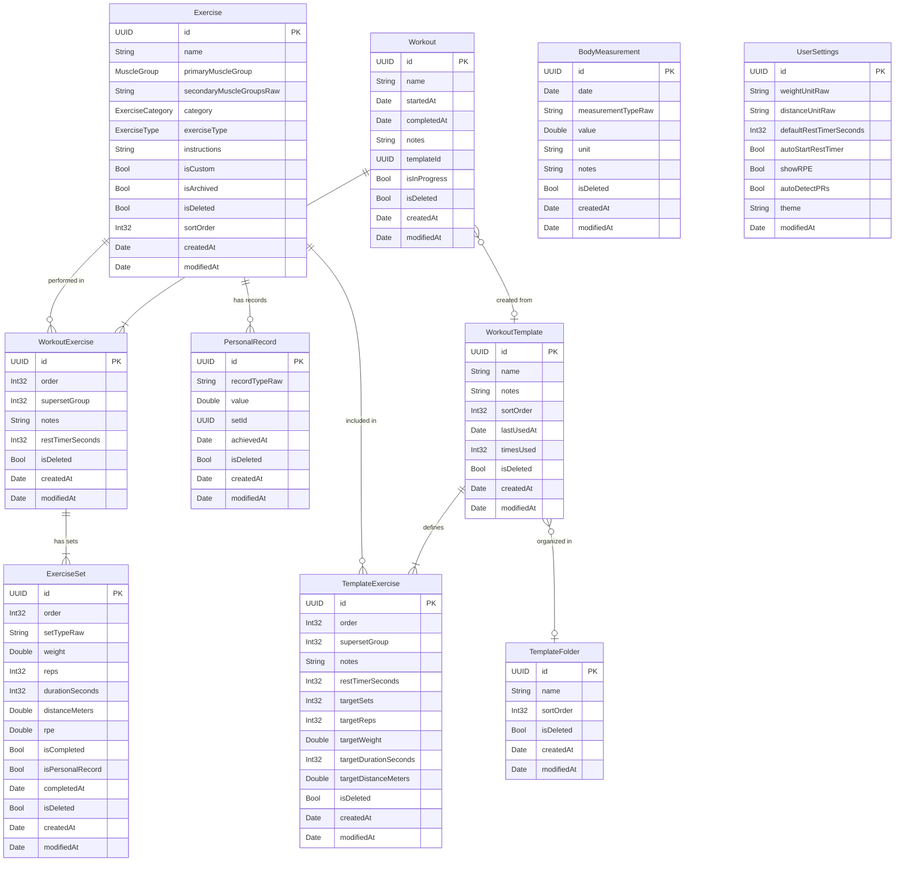

# Data Model Design -- Strength Tracker (iOS + Apple Watch)

> **⚠️ Historical design (January 2026, pre-implementation).** This document
> describes the original **Core Data + CloudKit** design. The shipped app uses
> **SwiftData** with different entity definitions (no `sortOrder`/`isDeleted`/
> `createdAt` fields, no `CDExercise+Extensions.swift`, no CloudKit sync). For
> the entities as actually implemented, see
> `StrengthTracker/Shared/Persistence/SwiftData/Entities/`.

**Version:** 1.0
**Date:** January 2026
**Status:** Approved for implementation
**Persistence:** Core Data with NSPersistentCloudKitContainer

---

## 1. Entity Relationship Diagram



---

## 2. Entity Definitions

### 2.1 Exercise

The exercise definition -- a reference/library entity representing the "what" being performed.

| Field | Core Data Type | Swift Type | Required | Default | Description |
|-------|---------------|------------|----------|---------|-------------|
| `id` | UUID | UUID | Yes | `UUID()` | Primary key |
| `name` | String | String | Yes | -- | Display name (e.g., "Bench Press") |
| `primaryMuscleGroup` | String | MuscleGroup (enum) | Yes | -- | Primary target muscle, stored as raw string |
| `secondaryMuscleGroupsRaw` | String | String | No | `""` | Comma-separated MuscleGroup raw values |
| `category` | String | ExerciseCategory (enum) | Yes | -- | Equipment type, stored as raw string |
| `exerciseType` | String | ExerciseType (enum) | Yes | -- | Tracking type, stored as raw string |
| `instructions` | String | String? | No | nil | How to perform the exercise |
| `isCustom` | Boolean | Bool | Yes | `false` | User-created vs. pre-populated |
| `isArchived` | Boolean | Bool | Yes | `false` | Soft-hidden from exercise picker |
| `isDeleted` | Boolean | Bool | Yes | `false` | Soft delete for CloudKit sync |
| `sortOrder` | Integer 32 | Int32 | No | 0 | User-defined sort preference |
| `createdAt` | Date | Date | Yes | `Date()` | Creation timestamp |
| `modifiedAt` | Date | Date | Yes | `Date()` | Last modification timestamp |

**Relationships:**
- `workoutExercises` -- To-Many to WorkoutExercise (inverse: `exercise`), Delete Rule: Deny
- `templateExercises` -- To-Many to TemplateExercise (inverse: `exercise`), Delete Rule: Cascade
- `personalRecords` -- To-Many to PersonalRecord (inverse: `exercise`), Delete Rule: Cascade

**CloudKit note on `secondaryMuscleGroupsRaw`:** CloudKit does not natively support arrays of enums. The secondary muscle groups are stored as a comma-separated string (e.g., `"triceps,shoulders"`) and converted in the `CDExercise+Extensions.swift` computed property. This avoids Transformable attributes that complicate CloudKit sync.

### 2.2 Workout

A single completed or in-progress workout session.

| Field | Core Data Type | Swift Type | Required | Default | Description |
|-------|---------------|------------|----------|---------|-------------|
| `id` | UUID | UUID | Yes | `UUID()` | Primary key |
| `name` | String | String | Yes | -- | Display name (e.g., "Push Day") |
| `startedAt` | Date | Date | Yes | -- | When the workout began |
| `completedAt` | Date | Date? | No | nil | When the workout ended (nil if in progress) |
| `notes` | String | String? | No | nil | General workout notes |
| `templateId` | UUID | UUID? | No | nil | Loose reference to originating template |
| `isInProgress` | Boolean | Bool | Yes | `true` | Active workout flag |
| `isDeleted` | Boolean | Bool | Yes | `false` | Soft delete for sync |
| `createdAt` | Date | Date | Yes | `Date()` | Record creation timestamp |
| `modifiedAt` | Date | Date | Yes | `Date()` | Last modification timestamp |

**Relationships:**
- `exercises` -- To-Many to WorkoutExercise (inverse: `workout`), Delete Rule: Cascade, Ordered

**Design decision:** `templateId` is a loose UUID reference (not a Core Data relationship) so templates can be deleted without affecting historical workouts. Duration is computed from `completedAt - startedAt` rather than stored separately, which correctly handles paused/resumed workouts.

### 2.3 WorkoutExercise

A specific exercise instance within a workout -- the join entity between Workout and Exercise with ordering and grouping metadata.

| Field | Core Data Type | Swift Type | Required | Default | Description |
|-------|---------------|------------|----------|---------|-------------|
| `id` | UUID | UUID | Yes | `UUID()` | Primary key |
| `order` | Integer 32 | Int32 | Yes | 0 | Position within the workout (0-indexed) |
| `supersetGroup` | Integer 32 | Int32? | No | nil | Superset grouping identifier |
| `notes` | String | String? | No | nil | Exercise-specific notes for this workout |
| `restTimerSeconds` | Integer 32 | Int32? | No | nil | Override rest timer for this exercise |
| `isDeleted` | Boolean | Bool | Yes | `false` | Soft delete for sync |
| `createdAt` | Date | Date | Yes | `Date()` | Record creation timestamp |
| `modifiedAt` | Date | Date | Yes | `Date()` | Last modification timestamp |

**Relationships:**
- `workout` -- To-One to Workout (inverse: `exercises`), Delete Rule: Nullify
- `exercise` -- To-One to Exercise (inverse: `workoutExercises`), Delete Rule: Nullify
- `sets` -- To-Many to ExerciseSet (inverse: `workoutExercise`), Delete Rule: Cascade, Ordered

**Superset design:** Exercises sharing the same non-nil `supersetGroup` value within a workout are supersetted. The integer is a grouping key, not an ordering index.

### 2.4 ExerciseSet

A single set within a workout exercise -- the most granular tracking unit.

| Field | Core Data Type | Swift Type | Required | Default | Description |
|-------|---------------|------------|----------|---------|-------------|
| `id` | UUID | UUID | Yes | `UUID()` | Primary key |
| `order` | Integer 32 | Int32 | Yes | 0 | Position within the exercise (0-indexed) |
| `setTypeRaw` | String | SetType (enum) | Yes | `"normal"` | Set type stored as raw string |
| `weight` | Double | Double? | No | nil | Weight in user's preferred unit |
| `reps` | Integer 32 | Int32? | No | nil | Number of repetitions |
| `durationSeconds` | Integer 32 | Int32? | No | nil | Duration for timed exercises |
| `distanceMeters` | Double | Double? | No | nil | Distance for cardio exercises |
| `rpe` | Double | Double? | No | nil | Rate of Perceived Exertion (1.0-10.0) |
| `isCompleted` | Boolean | Bool | Yes | `false` | Whether the set was actually performed |
| `isPersonalRecord` | Boolean | Bool | Yes | `false` | Flagged as PR at time of completion |
| `completedAt` | Date | Date? | No | nil | Timestamp when set was marked complete |
| `isDeleted` | Boolean | Bool | Yes | `false` | Soft delete for sync |
| `createdAt` | Date | Date | Yes | `Date()` | Record creation timestamp |
| `modifiedAt` | Date | Date | Yes | `Date()` | Last modification timestamp |

**Relationships:**
- `workoutExercise` -- To-One to WorkoutExercise (inverse: `sets`), Delete Rule: Nullify

**Field usage by exercise type:**

| ExerciseType | weight | reps | durationSeconds | distanceMeters |
|-------------|--------|------|-----------------|----------------|
| `weightedReps` | Yes | Yes | -- | -- |
| `bodyweightReps` | Optional (added weight) | Yes | -- | -- |
| `duration` | Optional | -- | Yes | -- |
| `cardio` | -- | -- | Yes | Yes |
| `weightedCardio` | Yes | -- | Optional | Yes |

### 2.5 WorkoutTemplate

A reusable workout blueprint (called "Routine" in Strong).

| Field | Core Data Type | Swift Type | Required | Default | Description |
|-------|---------------|------------|----------|---------|-------------|
| `id` | UUID | UUID | Yes | `UUID()` | Primary key |
| `name` | String | String | Yes | -- | Template name (e.g., "Push Day A") |
| `notes` | String | String? | No | nil | Template description |
| `sortOrder` | Integer 32 | Int32 | Yes | 0 | Position in template list |
| `lastUsedAt` | Date | Date? | No | nil | When template was last started |
| `timesUsed` | Integer 32 | Int32 | Yes | 0 | Usage count |
| `isDeleted` | Boolean | Bool | Yes | `false` | Soft delete for sync |
| `createdAt` | Date | Date | Yes | `Date()` | Record creation timestamp |
| `modifiedAt` | Date | Date | Yes | `Date()` | Last modification timestamp |

**Relationships:**
- `folder` -- To-One to TemplateFolder (inverse: `templates`), Delete Rule: Nullify
- `exercises` -- To-Many to TemplateExercise (inverse: `template`), Delete Rule: Cascade, Ordered

### 2.6 TemplateExercise

An exercise slot within a template, with target sets.

| Field | Core Data Type | Swift Type | Required | Default | Description |
|-------|---------------|------------|----------|---------|-------------|
| `id` | UUID | UUID | Yes | `UUID()` | Primary key |
| `order` | Integer 32 | Int32 | Yes | 0 | Position within the template |
| `supersetGroup` | Integer 32 | Int32? | No | nil | Superset grouping |
| `notes` | String | String? | No | nil | Default notes |
| `restTimerSeconds` | Integer 32 | Int32? | No | nil | Default rest timer |
| `targetSets` | Integer 32 | Int32 | Yes | 3 | Number of target sets |
| `targetReps` | Integer 32 | Int32? | No | nil | Target reps per set |
| `targetWeight` | Double | Double? | No | nil | Target weight |
| `targetDurationSeconds` | Integer 32 | Int32? | No | nil | Target duration |
| `targetDistanceMeters` | Double | Double? | No | nil | Target distance |
| `isDeleted` | Boolean | Bool | Yes | `false` | Soft delete for sync |
| `createdAt` | Date | Date | Yes | `Date()` | Record creation timestamp |
| `modifiedAt` | Date | Date | Yes | `Date()` | Last modification timestamp |

**Relationships:**
- `template` -- To-One to WorkoutTemplate (inverse: `exercises`), Delete Rule: Nullify
- `exercise` -- To-One to Exercise (inverse: `templateExercises`), Delete Rule: Nullify

### 2.7 TemplateFolder

Organizational grouping for templates (e.g., "PPL Program", "5/3/1").

| Field | Core Data Type | Swift Type | Required | Default | Description |
|-------|---------------|------------|----------|---------|-------------|
| `id` | UUID | UUID | Yes | `UUID()` | Primary key |
| `name` | String | String | Yes | -- | Folder name |
| `sortOrder` | Integer 32 | Int32 | Yes | 0 | Display position |
| `isDeleted` | Boolean | Bool | Yes | `false` | Soft delete for sync |
| `createdAt` | Date | Date | Yes | `Date()` | Record creation timestamp |
| `modifiedAt` | Date | Date | Yes | `Date()` | Last modification timestamp |

**Relationships:**
- `templates` -- To-Many to WorkoutTemplate (inverse: `folder`), Delete Rule: Nullify

### 2.8 BodyMeasurement

Tracked body metrics over time.

| Field | Core Data Type | Swift Type | Required | Default | Description |
|-------|---------------|------------|----------|---------|-------------|
| `id` | UUID | UUID | Yes | `UUID()` | Primary key |
| `date` | Date | Date | Yes | -- | Measurement date |
| `measurementTypeRaw` | String | MeasurementType (enum) | Yes | -- | Type stored as raw string |
| `value` | Double | Double | Yes | -- | Measurement value |
| `unit` | String | String | Yes | -- | Unit of measurement |
| `notes` | String | String? | No | nil | Optional notes |
| `isDeleted` | Boolean | Bool | Yes | `false` | Soft delete for sync |
| `createdAt` | Date | Date | Yes | `Date()` | Record creation timestamp |
| `modifiedAt` | Date | Date | Yes | `Date()` | Last modification timestamp |

### 2.9 PersonalRecord

Cached personal records for quick lookup and historical tracking.

| Field | Core Data Type | Swift Type | Required | Default | Description |
|-------|---------------|------------|----------|---------|-------------|
| `id` | UUID | UUID | Yes | `UUID()` | Primary key |
| `recordTypeRaw` | String | RecordType (enum) | Yes | -- | Record type stored as raw string |
| `value` | Double | Double | Yes | -- | The record value |
| `setId` | UUID | UUID? | No | nil | Reference to the ExerciseSet that achieved this PR |
| `achievedAt` | Date | Date | Yes | -- | When the record was set |
| `isDeleted` | Boolean | Bool | Yes | `false` | Soft delete for sync |
| `createdAt` | Date | Date | Yes | `Date()` | Record creation timestamp |
| `modifiedAt` | Date | Date | Yes | `Date()` | Last modification timestamp |

**Relationships:**
- `exercise` -- To-One to Exercise (inverse: `personalRecords`), Delete Rule: Nullify

**Design note:** While PRs can be computed by scanning all historical sets, caching them in a dedicated entity enables instant PR badge display and avoids expensive full-table scans. Records are recalculated when sets are edited or deleted.

### 2.10 UserSettings

Global user preferences. Single-row entity.

| Field | Core Data Type | Swift Type | Required | Default | Description |
|-------|---------------|------------|----------|---------|-------------|
| `id` | UUID | UUID | Yes | `UUID()` | Primary key |
| `weightUnitRaw` | String | WeightUnit (enum) | Yes | `"lbs"` | Default weight unit |
| `distanceUnitRaw` | String | DistanceUnit (enum) | Yes | `"miles"` | Default distance unit |
| `defaultRestTimerSeconds` | Integer 32 | Int32 | Yes | 90 | Default rest timer duration |
| `autoStartRestTimer` | Boolean | Bool | Yes | `true` | Auto-start timer after set completion |
| `showRPE` | Boolean | Bool | Yes | `false` | Whether RPE column is visible |
| `autoDetectPRs` | Boolean | Bool | Yes | `true` | Automatically flag personal records |
| `theme` | String | String | Yes | `"system"` | UI theme preference |
| `modifiedAt` | Date | Date | Yes | `Date()` | Last modification timestamp |

---

## 3. Enum Definitions

All enums use `String` raw values for CloudKit serialization compatibility.

```swift
enum MuscleGroup: String, Codable, CaseIterable {
    case chest, back, shoulders, biceps, triceps, forearms
    case core, quadriceps, hamstrings, glutes, calves
    case adductors, abductors, traps, lats
    case fullBody, cardio, other
}

enum ExerciseCategory: String, Codable, CaseIterable {
    case barbell, dumbbell, machine, cable, bodyweight
    case smithMachine, kettlebell, resistanceBand
    case plate, medicineBall, exerciseBall, trx
    case landmine, trapBar, ezBar, other
}

enum ExerciseType: String, Codable, CaseIterable {
    case weightedReps      // weight + reps
    case bodyweightReps    // reps (optional added weight)
    case duration          // seconds
    case cardio            // distance + duration
    case weightedCardio    // weight + distance
}

enum SetType: String, Codable, CaseIterable {
    case normal            // Standard working set
    case warmup            // Excluded from volume/PR calculations
    case dropset           // Reduced weight continuation
    case failure           // Performed to muscular failure
    case restPause         // Brief rest then continued reps
}

enum MeasurementType: String, Codable, CaseIterable {
    case bodyWeight, bodyFat
    case chest, leftArm, rightArm, leftForearm, rightForearm
    case waist, hips, leftThigh, rightThigh, leftCalf, rightCalf
    case shoulders, neck
}

enum RecordType: String, Codable, CaseIterable {
    case estimatedOneRepMax  // Highest calculated 1RM
    case maxWeight           // Heaviest weight lifted (any reps)
    case maxReps             // Most reps at any weight
    case maxVolume           // Highest single-set volume (weight x reps)
    case maxTotalVolume      // Highest total volume in one workout
    case bestPace            // Fastest pace (distance/time)
    case longestDuration     // Longest single duration
    case longestDistance      // Longest single distance
}

enum WeightUnit: String, Codable {
    case kg, lbs
}

enum DistanceUnit: String, Codable {
    case km, miles
}
```

---

## 4. Core Data Model Mapping

### 4.1 .xcdatamodeld Structure

The Core Data model is defined in `StrengthTracker.xcdatamodeld` with 10 entities. All enum fields are stored as `String` attributes (not Transformable) for CloudKit compatibility. Conversion to/from Swift enums happens in `+Extensions.swift` files via computed properties.

### 4.2 Core Data Extension Example

```swift
// CDExercise+Extensions.swift
extension CDExercise {
    var primaryMuscle: MuscleGroup {
        get { MuscleGroup(rawValue: primaryMuscleGroup ?? "") ?? .other }
        set { primaryMuscleGroup = newValue.rawValue }
    }

    var secondaryMuscles: [MuscleGroup] {
        get {
            guard let raw = secondaryMuscleGroupsRaw, !raw.isEmpty else { return [] }
            return raw.split(separator: ",").compactMap {
                MuscleGroup(rawValue: String($0))
            }
        }
        set {
            secondaryMuscleGroupsRaw = newValue.map(\.rawValue).joined(separator: ",")
        }
    }

    var exerciseCategory: ExerciseCategory {
        get { ExerciseCategory(rawValue: category ?? "") ?? .other }
        set { category = newValue.rawValue }
    }

    var trackingType: ExerciseType {
        get { ExerciseType(rawValue: exerciseType ?? "") ?? .weightedReps }
        set { exerciseType = newValue.rawValue }
    }
}
```

### 4.3 Domain Model Mapping

Core Data managed objects (`CDExercise`, `CDWorkout`, etc.) are not passed directly to views. Instead, they are mapped to plain Swift domain structs via mapper classes:

```swift
// Domain/Exercise.swift
struct Exercise: Identifiable, Hashable, Sendable {
    let id: UUID
    var name: String
    var primaryMuscleGroup: MuscleGroup
    var secondaryMuscleGroups: [MuscleGroup]
    var category: ExerciseCategory
    var exerciseType: ExerciseType
    var instructions: String?
    var isCustom: Bool
    var isArchived: Bool
}

// Mappers/ExerciseMapper.swift
enum ExerciseMapper {
    static func toDomain(_ entity: CDExercise) -> Exercise {
        Exercise(
            id: entity.id ?? UUID(),
            name: entity.name ?? "",
            primaryMuscleGroup: entity.primaryMuscle,
            secondaryMuscleGroups: entity.secondaryMuscles,
            category: entity.exerciseCategory,
            exerciseType: entity.trackingType,
            instructions: entity.instructions,
            isCustom: entity.isCustom,
            isArchived: entity.isArchived
        )
    }

    static func toEntity(_ domain: Exercise, context: NSManagedObjectContext) -> CDExercise {
        let entity = CDExercise(context: context)
        entity.id = domain.id
        entity.name = domain.name
        entity.primaryMuscle = domain.primaryMuscleGroup
        entity.secondaryMuscles = domain.secondaryMuscleGroups
        entity.exerciseCategory = domain.category
        entity.trackingType = domain.exerciseType
        entity.instructions = domain.instructions
        entity.isCustom = domain.isCustom
        entity.isArchived = domain.isArchived
        entity.createdAt = Date()
        entity.modifiedAt = Date()
        entity.isDeleted = false
        return entity
    }
}
```

---

## 5. Relationship Rules

| Parent | Child | Type | Ordered | Cascade Rule | Description |
|--------|-------|------|---------|--------------|-------------|
| Workout | WorkoutExercise | One-to-Many | Yes | Cascade Delete | Deleting a workout deletes all its exercises |
| WorkoutExercise | ExerciseSet | One-to-Many | Yes | Cascade Delete | Deleting a workout exercise deletes all its sets |
| Exercise | WorkoutExercise | One-to-Many | No | Deny Delete | Cannot delete exercise if used in workouts; must archive |
| Exercise | TemplateExercise | One-to-Many | No | Cascade Delete | Deleting exercise removes it from templates |
| Exercise | PersonalRecord | One-to-Many | No | Cascade Delete | Deleting exercise removes its PR records |
| WorkoutTemplate | TemplateExercise | One-to-Many | Yes | Cascade Delete | Deleting template deletes its exercise slots |
| TemplateFolder | WorkoutTemplate | One-to-Many | No | Nullify | Deleting folder sets template.folder to nil |

---

## 6. Index Strategy

Indexes optimize the most frequent query patterns identified in the app.

| Entity | Indexed Fields | Query Pattern |
|--------|---------------|---------------|
| Exercise | `name` | Search by name in exercise picker |
| Exercise | `primaryMuscleGroup` | Filter by muscle group |
| Exercise | `category` | Filter by equipment type |
| Exercise | `isCustom` | Separate custom from built-in |
| Exercise | `isDeleted` | Exclude soft-deleted records |
| Workout | `startedAt` (descending) | History timeline (newest first) |
| Workout | `isInProgress` | Find active workout on app launch |
| Workout | `templateId` | Find workouts from a specific template |
| Workout | `isDeleted` | Exclude soft-deleted records |
| WorkoutExercise | `workoutId, order` | Ordered exercises within a workout |
| WorkoutExercise | `exerciseId` | Exercise history lookup across workouts |
| ExerciseSet | `workoutExerciseId, order` | Ordered sets within an exercise |
| ExerciseSet | `isCompleted` | Filter completed vs. planned sets |
| BodyMeasurement | `date, measurementTypeRaw` | Timeline for specific measurement type |
| PersonalRecord | `exerciseId, recordTypeRaw` | PR lookup per exercise and type |
| PersonalRecord | `achievedAt` (descending) | Recent PRs timeline |
| WorkoutTemplate | `sortOrder` | Ordered template list |

**Compound index note:** Core Data supports compound indexes via the `.xcdatamodeld` inspector. The `workoutId + order` and `exerciseId + order` compound indexes are critical for maintaining ordering without in-memory sorting.

---

## 7. CloudKit Sync Considerations

### 7.1 UUID Primary Keys

All entities use client-generated `UUID` primary keys. This is mandatory for CloudKit because:

- Records can be created on any device independently (iPhone, Watch, second iPhone).
- No central authority is needed to assign IDs.
- UUID v4 collision probability is negligible.

### 7.2 Soft Deletes

Every entity includes `isDeleted: Bool` and `modifiedAt: Date`. Soft deletes are required because:

- A device offline during a delete needs to know the record was removed.
- Hard deletes would cause the record to reappear when the offline device syncs.
- All UI queries include `isDeleted == false` as a predicate.

**Tombstone cleanup:** A background task permanently removes soft-deleted records older than 30 days.

### 7.3 Conflict Resolution

Strategy: **last-writer-wins** at the field level.

1. `NSPersistentCloudKitContainer` uses `NSMergeByPropertyObjectTrumpMergePolicy` by default -- in-memory changes win over stored changes.
2. For simple fields, the record with the later `modifiedAt` wins.
3. For collections (sets within an exercise), merge by UUID -- sets present in either version are kept, with per-set `modifiedAt` resolving field conflicts.
4. Soft-deleted records always win over modifications with earlier timestamps.

### 7.4 CloudKit Record Type Mapping

| Core Data Entity | CloudKit Record Type | Zone |
|-----------------|---------------------|------|
| CDExercise | `CD_CDExercise` | com.app.strength-tracker (Private) |
| CDWorkout | `CD_CDWorkout` | com.app.strength-tracker (Private) |
| CDWorkoutExercise | `CD_CDWorkoutExercise` | com.app.strength-tracker (Private) |
| CDExerciseSet | `CD_CDExerciseSet` | com.app.strength-tracker (Private) |
| CDWorkoutTemplate | `CD_CDWorkoutTemplate` | com.app.strength-tracker (Private) |
| CDTemplateExercise | `CD_CDTemplateExercise` | com.app.strength-tracker (Private) |
| CDTemplateFolder | `CD_CDTemplateFolder` | com.app.strength-tracker (Private) |
| CDBodyMeasurement | `CD_CDBodyMeasurement` | com.app.strength-tracker (Private) |
| CDPersonalRecord | `CD_CDPersonalRecord` | com.app.strength-tracker (Private) |
| CDUserSettings | `CD_CDUserSettings` | com.app.strength-tracker (Private) |

All records use the **private database** with a **custom zone** for atomic commits and efficient change tracking via `CKServerChangeToken`.

### 7.5 CloudKit-Compatible Attribute Rules

1. All attributes must have default values or be optional (CloudKit requirement).
2. Enums are stored as `String` raw values, not Transformable.
3. Arrays (like `secondaryMuscleGroups`) are stored as comma-separated strings, not Transformable.
4. Ordered relationships use an explicit `order: Int32` field rather than Core Data's native ordered relationship (which does not sync well with CloudKit).
5. No `Transformable` attributes -- everything is a standard Core Data type (String, Int32, Double, Boolean, Date, UUID).

---

## 8. Computed Properties

These are calculated at read time, not stored in the database.

### 8.1 Estimated 1RM (Epley Formula)

```swift
func estimatedOneRepMax(weight: Double, reps: Int) -> Double? {
    guard reps > 0, reps <= 12, weight > 0 else { return nil }
    if reps == 1 { return weight }
    return weight * (1.0 + Double(reps) / 30.0)
}
```

### 8.2 Volume

```swift
// Per-set volume (only completed, non-warmup sets)
var setVolume: Double {
    guard isCompleted, setType != .warmup else { return 0 }
    return (weight ?? 0) * Double(reps ?? 0)
}

// Per-exercise volume
var exerciseVolume: Double {
    sets.filter { $0.isCompleted && $0.setType != .warmup }
        .reduce(0) { $0 + $1.setVolume }
}

// Total workout volume
var totalVolume: Double {
    exercises.reduce(0) { $0 + $1.exerciseVolume }
}
```

### 8.3 Workout Duration

```swift
var duration: TimeInterval? {
    guard let end = completedAt else { return nil }
    return end.timeIntervalSince(startedAt)
}
```

---

## 9. Apple Watch Data Models

The Watch uses lightweight `Codable` structs (not Core Data) to minimize memory. These are synced from iPhone via WatchConnectivity.

```swift
struct WatchExercise: Codable, Identifiable {
    let id: UUID
    let name: String
    let exerciseType: ExerciseType
    let category: ExerciseCategory
}

struct WatchTemplate: Codable, Identifiable {
    let id: UUID
    let name: String
    let exercises: [WatchTemplateExercise]
}

struct WatchTemplateExercise: Codable {
    let exerciseId: UUID
    let order: Int
    let targetSets: Int
    let targetReps: Int?
    let targetWeight: Double?
}

struct WatchActiveWorkout: Codable, Identifiable {
    let id: UUID
    var name: String
    let startedAt: Date
    var exercises: [WatchActiveExercise]
}

struct WatchActiveExercise: Codable, Identifiable {
    let id: UUID
    let exerciseId: UUID
    let order: Int
    var sets: [WatchActiveSet]
}

struct WatchActiveSet: Codable, Identifiable {
    let id: UUID
    let order: Int
    var setType: SetType
    var weight: Double?
    var reps: Int?
    var durationSeconds: Int?
    var isCompleted: Bool
}
```

**Estimated Watch data sizes:**

| Data | Size | Transfer Frequency |
|------|------|--------------------|
| Exercise library (200 exercises) | ~40 KB | On change / daily |
| Template list (10 templates) | ~15 KB | On change / daily |
| Active workout (10 exercises, 40 sets) | ~8 KB | Real-time during workout |
| User settings | < 1 KB | On change |

---

## 10. Data Volume Estimates

For an active user after 1 year of use (4 workouts/week, 6 exercises each, 4 sets each):

| Entity | Record Count | Avg Size | Total |
|--------|-------------|----------|-------|
| Exercise | ~230 (200 default + 30 custom) | 500 B | ~115 KB |
| Workout | ~200 | 200 B | ~40 KB |
| WorkoutExercise | ~1,200 | 150 B | ~180 KB |
| ExerciseSet | ~4,800 | 100 B | ~480 KB |
| WorkoutTemplate | ~10 | 200 B | ~2 KB |
| TemplateExercise | ~60 | 150 B | ~9 KB |
| BodyMeasurement | ~365 | 100 B | ~37 KB |
| PersonalRecord | ~300 | 100 B | ~30 KB |
| **Total** | **~7,165** | -- | **~893 KB** |

Storage is negligible for both local SQLite and CloudKit. Even a 5-year power user would remain under 5 MB.

---

## 11. Migration Strategy

Core Data lightweight migration handles most schema evolution automatically. For the initial release, a single schema version is sufficient. Future versions follow this pattern:

```swift
// PersistenceController.swift
let container = NSPersistentCloudKitContainer(name: "StrengthTracker")

// Lightweight migration is enabled by default
let description = container.persistentStoreDescriptions.first
description?.setOption(true as NSNumber,
    forKey: NSMigratePersistentStoresAutomaticallyOption)
description?.setOption(true as NSNumber,
    forKey: NSInferMappingModelAutomaticallyOption)
```

For breaking changes, custom mapping models will be created. All migrations are tested against the previous version's SQLite store before release.
