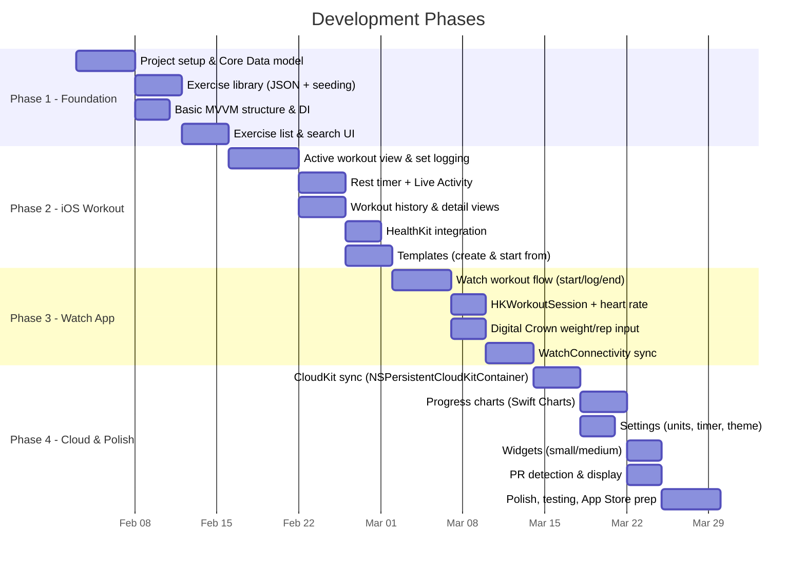

# MVP Scope and Phasing -- Strength Tracker (iOS + Apple Watch)

**Version:** 1.0
**Date:** January 2026
**Status:** Approved for implementation

---

## 1. MVP Philosophy

The MVP delivers a fully functional strength training tracker that a user can rely on as their daily workout companion. The guiding principles:

- **Core workflow first.** A user must be able to start a workout, log sets with weight/reps, see their previous performance, get rest timer alerts, and view their history.
- **Apple ecosystem native.** CloudKit sync (no account needed), HealthKit integration, standalone Watch app, and Live Activity for the rest timer.
- **No paywalls on core features.** Unlike competitors (Strong, Hevy), charts, templates, and Watch support are free. This is the primary differentiator.
- **Ship quality over feature count.** Fewer features, polished. Deferred features are explicitly listed.

---

## 2. Phase Overview

---

## 3. Phase 1: Foundation (Weeks 1-2)

### Deliverables

| Item | Description | Files |
|------|-------------|-------|
| Xcode project | iOS 17+ target, watchOS 10+ target, Shared framework | `StrengthTracker.xcodeproj` |
| Core Data model | All 10 entities in `.xcdatamodeld` with relationships and indexes | `Shared/Models/CoreData/StrengthTracker.xcdatamodeld` |
| Domain models | Plain Swift structs for all entities | `Shared/Models/Domain/*.swift` |
| Enum definitions | All enums (MuscleGroup, ExerciseCategory, ExerciseType, SetType, etc.) | `Shared/Models/Domain/Enums.swift` |
| Mappers | Core Data <-> Domain conversion | `Shared/Models/Mappers/*.swift` |
| Persistence controller | Core Data stack setup (without CloudKit initially) | `Shared/Services/PersistenceController.swift` |
| Exercise repository | Protocol + Core Data implementation | `Shared/Repositories/` |
| Exercise library seed | 200+ exercises in bundled JSON, seeded on first launch | `Resources/ExerciseLibrary.json` |
| Exercise list UI | Browse, search, filter by muscle group and equipment | `iOS/Features/ExerciseLibrary/` |
| App dependencies | DI container with protocol-based injection | `iOS/App/AppDependencies.swift` |
| Tab bar navigation | Root TabView with 4 tabs (Workout, History, Exercises, Profile) | `iOS/App/ContentView.swift` |

### Acceptance Criteria

- App launches and displays exercise library.
- Exercises can be searched by name and filtered by muscle group or equipment.
- Core Data persists data across app restarts.
- Unit tests pass for ExerciseRepository and ExerciseMapper.

---

## 4. Phase 2: iOS Workout Flow (Weeks 3-5)

### Deliverables

| Item | Description | Files |
|------|-------------|-------|
| Active workout view | Full-screen workout logging with exercise cards and set rows | `iOS/Features/Workout/Views/ActiveWorkoutView.swift` |
| Set logging | Weight/reps input, previous performance display, set completion | `iOS/Features/Workout/Views/ExerciseSetRowView.swift` |
| Set types | Normal, warmup, dropset, failure toggle on set number | `iOS/Features/Workout/Views/SetTypeSelector.swift` |
| Add exercise to workout | Exercise picker integrated into active workout | `iOS/Features/Workout/Views/AddExerciseView.swift` |
| Rest timer | Auto-start on set completion, configurable duration, skip/+30s/-30s | `Shared/Services/RestTimerService.swift` |
| Live Activity | Rest timer countdown on lock screen and Dynamic Island | `iOS/LiveActivity/RestTimerLiveActivity.swift` |
| Push notification | Rest timer expiry notification when app is backgrounded | -- |
| Workout repository | Protocol + Core Data implementation for workout CRUD | `Shared/Repositories/` |
| Workout history | Reverse chronological list with date, name, duration, volume | `iOS/Features/History/Views/WorkoutHistoryView.swift` |
| Workout detail | Full workout review (all exercises, sets, notes) | `iOS/Features/History/Views/WorkoutDetailView.swift` |
| HealthKit service | Write HKWorkout on workout completion | `Shared/Services/HealthKitService.swift` |
| Templates | Create template from scratch or from completed workout; start workout from template | `iOS/Features/Workout/Views/TemplateListView.swift` |
| Template auto-fill | Previous weight/reps auto-populated when starting from template | -- |

### Acceptance Criteria

- User can start an empty workout or start from a template.
- User can add exercises, log weight/reps per set, and mark sets complete.
- Rest timer auto-starts on set completion and shows on lock screen (Live Activity).
- Completed workouts appear in history with full detail.
- Workouts are saved to HealthKit.
- Templates can be created, edited, and used to start workouts.

---

## 5. Phase 3: Watch App (Weeks 6-8)

### Deliverables

| Item | Description | Files |
|------|-------------|-------|
| Watch entry point | Standalone SwiftUI `@main` app | `WatchApp/App/StrengthTrackerWatchApp.swift` |
| Watch workout list | Template list + Quick Start button | `WatchApp/Features/WorkoutList/WatchWorkoutListView.swift` |
| Watch active workout | Vertical TabView with exercise/controls/metrics pages | `WatchApp/Features/ActiveWorkout/WatchActiveWorkoutView.swift` |
| Watch set entry | Weight and reps input with Digital Crown and +/- buttons | `WatchApp/Features/ActiveWorkout/WatchExerciseSetEntry.swift` |
| Watch rest timer | Full-screen countdown with haptic completion | `WatchApp/Features/ActiveWorkout/WatchRestTimerView.swift` |
| Watch workout summary | Post-workout stats (duration, volume, sets, calories) | `WatchApp/Features/Summary/WatchWorkoutSummaryView.swift` |
| HKWorkoutSession | Workout session lifecycle, heart rate, calories | `WatchApp/ViewModels/WatchWorkoutSessionManager.swift` |
| WatchConnectivity | Real-time set sync, exercise library transfer, settings transfer | `Shared/Services/ConnectivityManager.swift` |
| Watch data models | Lightweight Codable structs for Watch | `Shared/Models/Domain/WatchModels.swift` |

### Acceptance Criteria

- User can start a workout on Watch from template or Quick Start.
- User can log sets using Digital Crown for weight/rep adjustment.
- Rest timer triggers haptic tap on completion.
- Heart rate is displayed during workout.
- Completed workout syncs to iPhone (even if done offline).
- Exercise library and templates are synced from iPhone to Watch.

---

## 6. Phase 4: Cloud and Polish (Weeks 9-12)

### Deliverables

| Item | Description | Files |
|------|-------------|-------|
| CloudKit sync | `NSPersistentCloudKitContainer` configuration, remote change handling | `Shared/Services/PersistenceController.swift` (updated) |
| Progress charts | Per-exercise 1RM, volume, weight progression over time | `iOS/Features/Progress/Views/ExerciseProgressChart.swift` |
| Time range filters | 1 month, 3 months, 6 months, 1 year, all time | -- |
| PR detection | Automatic detection on set completion (max weight, max reps, estimated 1RM, max volume) | `Shared/Services/PRDetectionService.swift` |
| PR display | Trophy icon on PR sets in workout view and history | -- |
| Personal record repository | Cached PR storage and lookup | `Shared/Repositories/` |
| Settings screen | Weight unit, distance unit, default rest timer, auto-start timer, RPE toggle, theme | `iOS/Features/Settings/` |
| Unit conversion | Metric/imperial conversion throughout the app | `Shared/Services/UnitConversionService.swift` |
| Widgets | Small (last workout date) and Medium (recent workout summary) | `iOS/Widgets/` |
| Calendar view | Monthly calendar with dots on workout days | `iOS/Features/History/Views/CalendarView.swift` |
| App Store preparation | App icon, screenshots, description, privacy policy, HealthKit review notes | -- |
| Test coverage | Unit tests for all repositories, view models, and services; UI tests for critical flows | `Tests/` |

### Acceptance Criteria

- Data syncs across devices via CloudKit (test with two iPhones or iPhone + iPad).
- Charts display per-exercise progression with time range filters.
- PRs are detected and highlighted with trophy icons.
- Settings persist and sync across devices.
- Widgets display on home screen and lock screen.
- App is ready for App Store submission.

---

## 7. Feature Scope: In MVP vs. Deferred

### In MVP (Phases 1-4)

| Feature | Phase | Notes |
|---------|-------|-------|
| Exercise library (200+ exercises) | 1 | Pre-populated JSON, search, filter |
| Custom exercise creation | 1 | Name, muscle group, equipment, type |
| Active workout logging (weight/reps) | 2 | Full set logging with previous performance |
| Set types (normal/warmup/dropset/failure) | 2 | Toggle on set number |
| Rest timer with Live Activity | 2 | Auto-start, configurable, lock screen |
| Workout history (reverse chronological) | 2 | List + detail views |
| Workout templates | 2 | Create, edit, start from template |
| HealthKit write (HKWorkout) | 2 | On workout completion |
| Apple Watch workout flow | 3 | Start, log sets, rest timer, summary |
| Digital Crown input | 3 | Weight and rep adjustment |
| Watch haptic rest timer | 3 | Full-screen countdown |
| HKWorkoutSession (heart rate, calories) | 3 | Standalone Watch workout |
| WatchConnectivity sync | 3 | Real-time + queued |
| CloudKit sync | 4 | Automatic, no account needed |
| Progress charts (per-exercise) | 4 | 1RM, volume, weight over time |
| PR detection and display | 4 | Max weight, max reps, est. 1RM, max volume |
| Settings (units, timer, theme) | 4 | Full settings screen |
| Widgets (small + medium) | 4 | Last workout, recent summary |
| Calendar view in history | 4 | Monthly dots |
| RPE tracking | 2 | Optional per-set field |
| Notes (per workout and per exercise) | 2 | Text fields |
| Dark mode | 1 | Default, follows system |

### Deferred (Post-MVP)

| Feature | Priority | Rationale for Deferral |
|---------|----------|----------------------|
| Supersets | High | Requires complex UI grouping and superset-aware rest timer; core workout flow works without it |
| Body measurements | Medium | Separate feature vertical; not core to strength tracking MVP |
| Body measurement charts | Medium | Depends on body measurements feature |
| Muscle volume distribution chart | Medium | Nice-to-have analytics; requires aggregation logic |
| CSV export | Medium | Users expect it eventually but not for first launch |
| CSV import (Strong/Hevy/FitNotes) | Medium | Onboarding aid; valuable but complex parsing |
| Plate calculator | Low | Utility feature; not core workflow |
| Template folders | Low | Organization feature for power users with many templates |
| Watch complications | Low | Useful but not required for core experience |
| Large widget | Low | Small and medium cover primary use cases |
| Exercise archives/favorites | Low | Can use search in MVP |
| Workout summary sharing (image) | Low | Social feature; not core |
| Per-exercise unit overrides | Low | Global unit setting sufficient for MVP |
| Workout reminders (scheduled notifications) | Low | Standard notification; not core |
| iPad layout optimization | Low | iPhone layout works on iPad; dedicated layout is polish |
| Drag-to-reorder exercises mid-workout | Medium | Long-press menu with "Move Up/Down" as interim |

---

## 8. Key Differentiators (vs. Strong, Hevy)

| Differentiator | Strong | Hevy | Strength Tracker |
|---------------|--------|------|------------------|
| CloudKit sync (no account) | No (own server, requires account) | No (own server, requires account) | Yes -- sync just works via iCloud |
| Free charts | Pro only | Yes | Yes |
| Free unlimited templates | ~3 free | Yes | Yes |
| Standalone Watch app | Yes | Yes | Yes |
| Live Activity rest timer | No | No | Yes |
| Free unlimited custom exercises | Limited free | Yes | Yes |
| No subscription required | Core free, Pro paid | Core free, Pro paid | All features free |
| Zero third-party dependencies | Unknown | Unknown | Yes -- smaller binary, no supply chain risk |

---

## 9. Success Criteria for MVP Launch

| Metric | Target |
|--------|--------|
| Crash-free rate | > 99.5% |
| App launch to workout start | < 3 taps |
| Set logging speed | < 3 seconds per set |
| Rest timer accuracy | +/- 0.5 seconds |
| CloudKit sync latency | < 30 seconds for typical changes |
| Watch workout with no iPhone | Fully functional |
| Test coverage (unit) | > 80% for repositories and view models |
| Test coverage (UI) | Critical flows (start workout, log set, end workout) |
| App Store review readiness | HealthKit usage descriptions, privacy policy, screenshots |

---

## 10. Risk Assessment

| Risk | Impact | Likelihood | Mitigation |
|------|--------|------------|------------|
| CloudKit sync delays frustrate users | Medium | Medium | WatchConnectivity for real-time Watch sync; show sync indicator; design for eventual consistency |
| Watch memory pressure during long workouts | High | Low | Keep Watch views lightweight; test 90+ minute workouts on real hardware; minimize data loaded |
| Core Data migration failure on update | High | Low | Test all migrations; keep schema changes simple; implement data export early |
| HealthKit permission denied | Low | Medium | App works fully without HealthKit; show clear permission rationale |
| Swift 6 concurrency strictness slows development | Low | Medium | Adopt incrementally; use `@MainActor` broadly; enable strict concurrency per-target |
| Exercise library too small at launch | Medium | Low | Ship with 200+ exercises; allow custom creation from day one |
| Rest timer Live Activity reliability | Medium | Low | Test backgrounded scenarios extensively; fallback to local notification |
