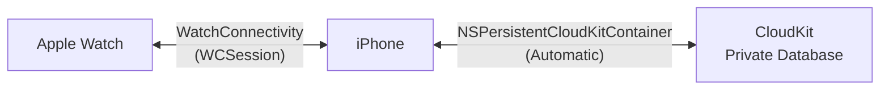
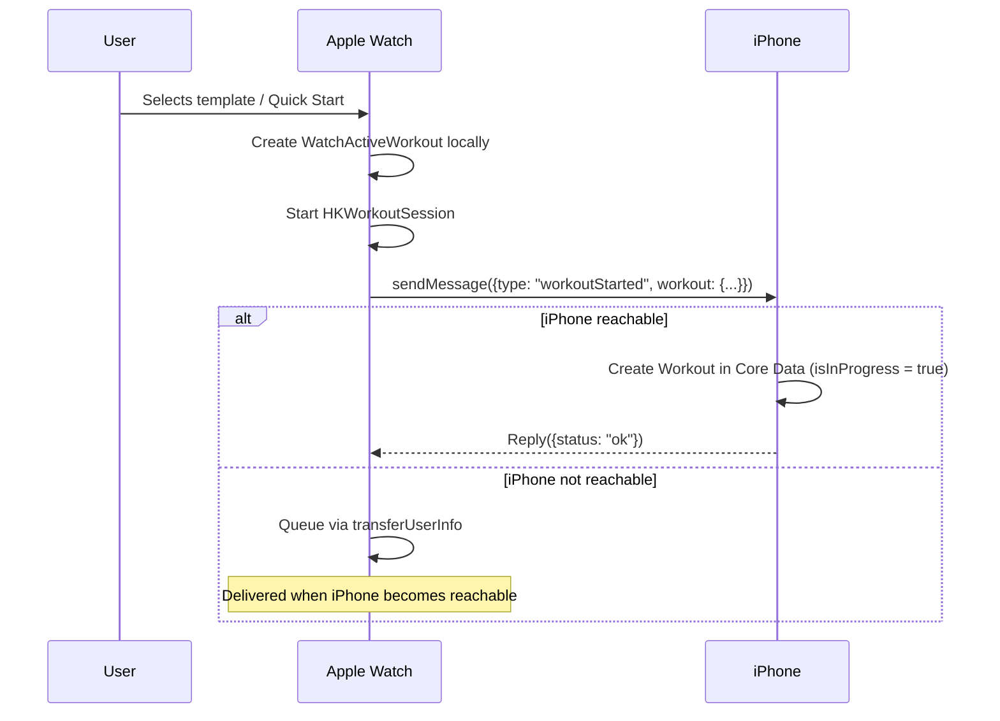
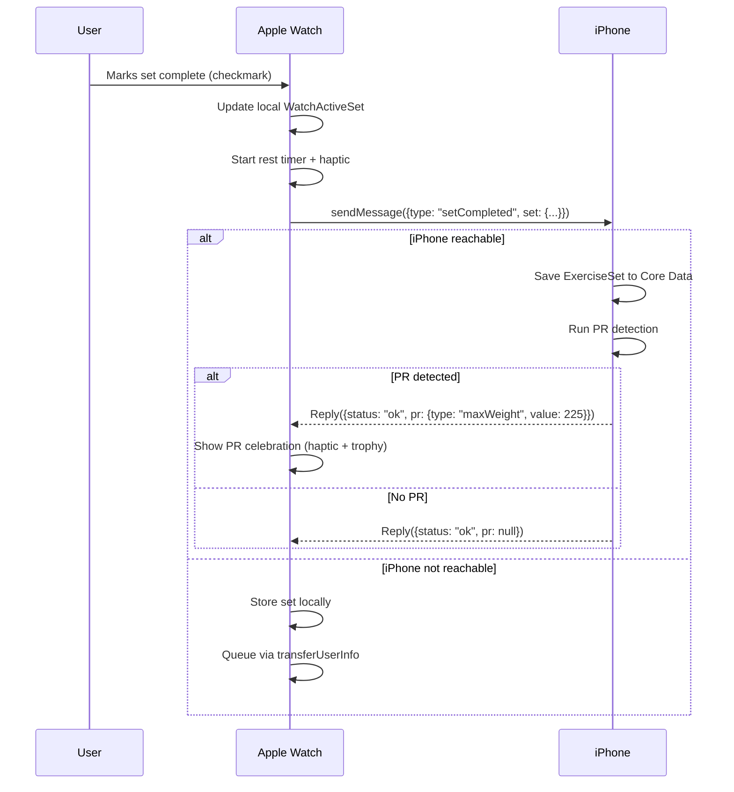
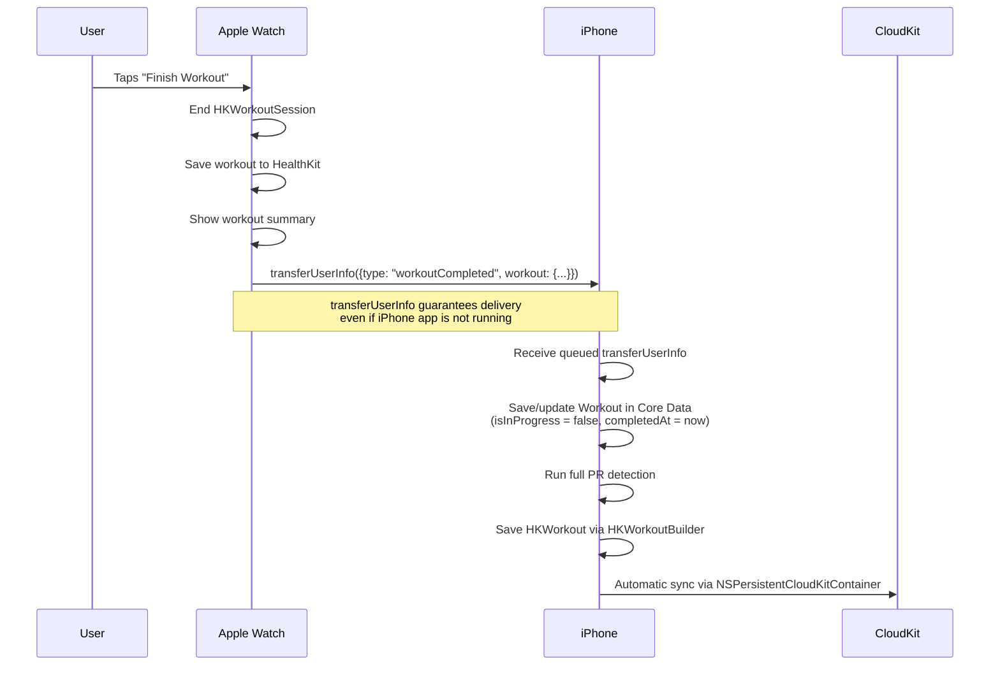
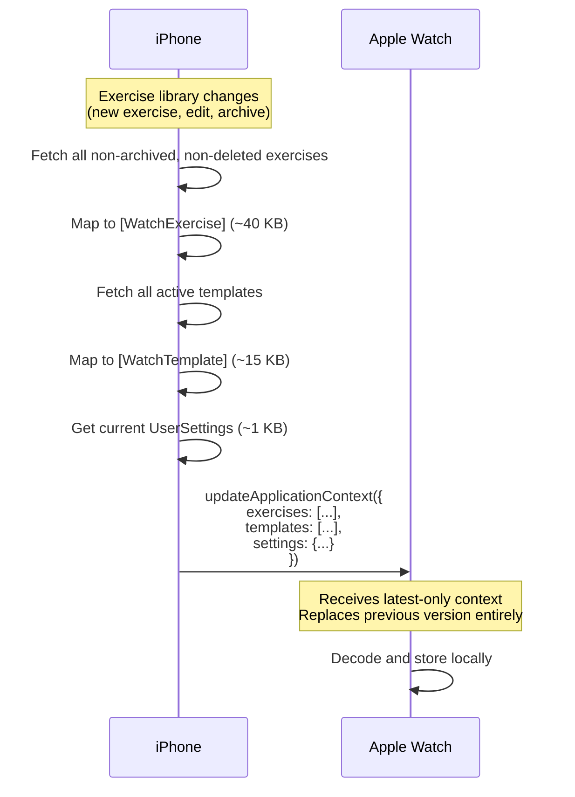
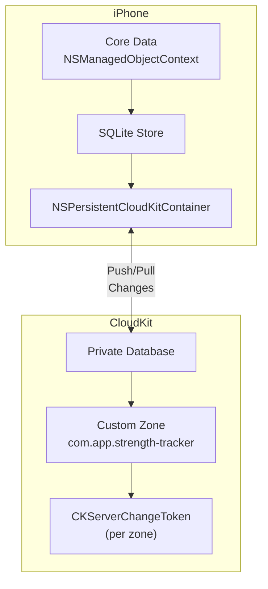
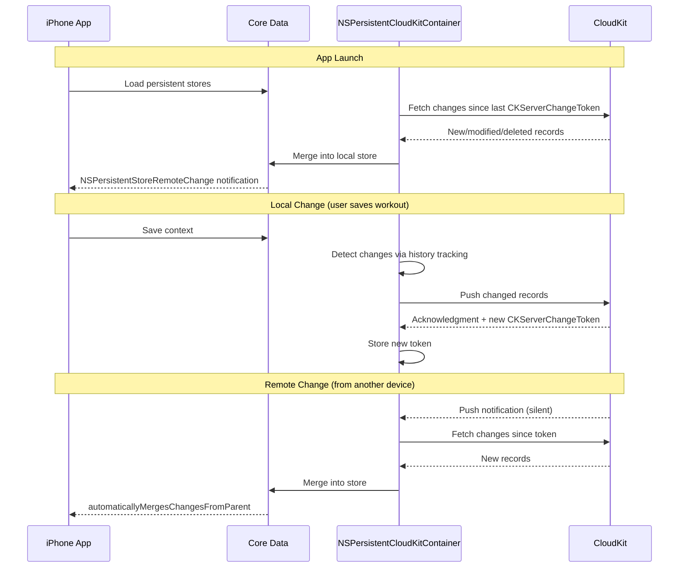

# Sync Strategy -- Strength Tracker (iOS + Apple Watch)

**Version:** 1.0
**Date:** January 2026
**Status:** Approved for implementation

---

## 1. Overview

Strength Tracker synchronizes data across three systems using two distinct sync mechanisms:

| Sync Path | Mechanism | Purpose |
|-----------|-----------|---------|
| iPhone <-> Apple Watch | WatchConnectivity (WCSession) | Real-time workout data during sessions; exercise library and settings transfer |
| iPhone <-> CloudKit | NSPersistentCloudKitContainer | Cross-device sync (iPhone-to-iPhone, restore on new device) |
| Watch -> CloudKit | Indirect (via iPhone) | Watch data reaches CloudKit by syncing to iPhone first |



There is no direct Watch-to-CloudKit path. All cloud sync flows through the iPhone. This is by design -- NSPersistentCloudKitContainer runs on the iPhone's Core Data stack, and the Watch uses lightweight Codable structs rather than Core Data.

---

## 2. WatchConnectivity Sync (iPhone <-> Watch)

### 2.1 Transfer Method Selection

WatchConnectivity provides four transfer methods, each suited to different data characteristics:

| Method | Delivery | Guarantee | Size | Overwrites | Use Case |
|--------|----------|-----------|------|------------|----------|
| `sendMessage` | Real-time | None (requires reachability) | ~65 KB | No | Active set completion, PR notifications |
| `updateApplicationContext` | Latest-only | Eventual | ~65 KB | Yes (latest wins) | Exercise library, settings, template list |
| `transferUserInfo` | Queued FIFO | Guaranteed delivery | ~65 KB each | No | Completed workout, queued sets |
| `transferFile` | Background | Guaranteed delivery | Up to ~100 MB | No | Full database sync, exercise library JSON |

### 2.2 Sync Method Matrix

| Data | Direction | Primary Method | Fallback | Rationale |
|------|-----------|---------------|----------|-----------|
| Set completion (during workout) | Watch -> iPhone | `sendMessage` | `transferUserInfo` | Real-time UI update on iPhone; falls back if unreachable |
| Workout started | Watch -> iPhone | `sendMessage` | `transferUserInfo` | iPhone shows "workout in progress" |
| Workout completed | Watch -> iPhone | `transferUserInfo` | -- | Guaranteed delivery even if iPhone app is not running |
| Exercise library | iPhone -> Watch | `updateApplicationContext` | `transferFile` (for initial sync) | Latest-only; Watch needs current version, not history |
| User settings | iPhone -> Watch | `updateApplicationContext` | -- | Latest-only; small payload |
| Template list | iPhone -> Watch | `updateApplicationContext` | -- | Latest-only; replaced entirely on each update |
| PR notification | iPhone -> Watch | `sendMessage` | -- | Real-time celebration; non-critical if missed |
| Complication data | iPhone -> Watch | `transferCurrentComplicationUserInfo` | -- | High-priority; limited to 50/day |
| Full initial sync | iPhone -> Watch | `transferFile` | -- | First-time setup or recovery; up to 100 MB |

### 2.3 Data Flow: Workout Started on Watch



### 2.4 Data Flow: Set Completed on Watch



### 2.5 Data Flow: Workout Completed on Watch



### 2.6 Data Flow: Exercise Library Sync (iPhone -> Watch)



### 2.7 Offline Scenarios

The system handles all connectivity states gracefully:

| Scenario | Watch Behavior | iPhone Behavior | Resolution |
|----------|---------------|-----------------|------------|
| Watch starts workout, iPhone nearby | `sendMessage` for real-time sync | Receives and saves immediately | Real-time |
| Watch starts workout, iPhone not reachable | Stores locally, queues via `transferUserInfo` | -- | Syncs when reconnected |
| Watch completes workout offline | Saves locally + HKWorkoutSession saves to Watch HealthKit | -- | `transferUserInfo` delivers when reconnected; iPhone saves to Core Data + CloudKit |
| iPhone has no network | -- | Saves to Core Data locally | CloudKit syncs when network returns (automatic) |
| Both devices offline | Watch stores locally | iPhone stores locally | Watch syncs to iPhone via WatchConnectivity; iPhone syncs to CloudKit when network returns |

### 2.8 ConnectivityManager Implementation Pattern

```swift
final class ConnectivityManager: NSObject, WCSessionDelegate {
    static let shared = ConnectivityManager()

    func activate() {
        guard WCSession.isSupported() else { return }
        WCSession.default.delegate = self
        WCSession.default.activate()
    }

    // MARK: - Send to iPhone (from Watch)

    func sendSetCompleted(_ set: WatchActiveSet, workoutId: UUID) {
        let payload: [String: Any] = [
            "type": "setCompleted",
            "workoutId": workoutId.uuidString,
            "set": try! JSONEncoder().encode(set)
        ]

        guard WCSession.default.isReachable else {
            // Guaranteed delivery fallback
            WCSession.default.transferUserInfo(payload)
            return
        }
        WCSession.default.sendMessage(payload, replyHandler: { reply in
            // Handle PR notification in reply
        }, errorHandler: { error in
            // Fall back to transferUserInfo
            WCSession.default.transferUserInfo(payload)
        })
    }

    // MARK: - Send to Watch (from iPhone)

    func syncContextToWatch(exercises: [WatchExercise],
                            templates: [WatchTemplate],
                            settings: WatchUserSettings) {
        let context: [String: Any] = [
            "exercises": try! JSONEncoder().encode(exercises),
            "templates": try! JSONEncoder().encode(templates),
            "settings": try! JSONEncoder().encode(settings)
        ]
        try? WCSession.default.updateApplicationContext(context)
    }
}
```

---

## 3. CloudKit Sync (iPhone <-> Cloud)

### 3.1 Architecture

CloudKit sync uses `NSPersistentCloudKitContainer`, which wraps Core Data with automatic bidirectional sync to CloudKit's private database.



### 3.2 Sync Configuration

```swift
class PersistenceController {
    let container: NSPersistentCloudKitContainer

    init() {
        container = NSPersistentCloudKitContainer(name: "StrengthTracker")

        guard let description = container.persistentStoreDescriptions.first else {
            fatalError("No store description")
        }

        // CloudKit container
        description.cloudKitContainerOptions =
            NSPersistentCloudKitContainerOptions(
                containerIdentifier: "iCloud.com.app.strengthtracker"
            )

        // Required: remote change notifications
        description.setOption(true as NSNumber,
            forKey: NSPersistentStoreRemoteChangeNotificationPostOptionKey)

        // Required: history tracking
        description.setOption(true as NSNumber,
            forKey: NSPersistentHistoryTrackingKey)

        container.loadPersistentStores { _, error in
            if let error { fatalError("Store failed: \(error)") }
        }

        // Auto-merge remote changes into viewContext
        container.viewContext.automaticallyMergesChangesFromParent = true
        container.viewContext.mergePolicy = NSMergeByPropertyObjectTrumpMergePolicy
    }
}
```

### 3.3 Sync Lifecycle



### 3.4 Conflict Resolution Strategy

| Scenario | Resolution | Rationale |
|----------|-----------|-----------|
| Same workout edited on two devices | `NSMergeByPropertyObjectTrumpMergePolicy` -- in-memory wins | Workout data is rarely edited concurrently |
| Same exercise renamed on two devices | Last-write-wins via `modifiedAt` | Exercise edits are infrequent |
| Set added on Watch while offline | Merge by UUID -- both versions kept | Sets are append-only; no conflict |
| Record deleted on one device, modified on another | Delete wins (soft delete with later `modifiedAt`) | Intentional deletions should propagate |
| New workout on offline device | No conflict -- unique UUID | UUIDs prevent ID collision |

### 3.5 Remote Change Handling

```swift
// Observe remote changes for custom UI updates
NotificationCenter.default.addObserver(
    forName: .NSPersistentStoreRemoteChange,
    object: container.persistentStoreCoordinator,
    queue: .main
) { _ in
    // viewContext auto-merges, but we can:
    // - Show "new data synced" indicator
    // - Refresh PR calculations
    // - Update Watch context if exercise library changed
}
```

---

## 4. Watch Data Subset Strategy

The Watch does not run Core Data or CloudKit. It operates on a lightweight subset of data synced from the iPhone.

### 4.1 What Lives on the Watch

| Data | Storage | Source | Update Trigger |
|------|---------|--------|----------------|
| Exercise library (active, non-deleted) | In-memory + UserDefaults | `updateApplicationContext` from iPhone | Exercise add/edit/archive |
| Template list (active, non-deleted) | In-memory + UserDefaults | `updateApplicationContext` from iPhone | Template add/edit/delete |
| User settings | In-memory + UserDefaults | `updateApplicationContext` from iPhone | Settings change |
| Active workout | In-memory | Created locally on Watch | User starts workout |
| Completed workout (pending sync) | UserDefaults queue | Created locally on Watch | Workout completion |

### 4.2 What Does NOT Live on the Watch

- Full workout history
- Progress charts data
- Body measurements
- Full PR history (only receives real-time PR notifications)
- Core Data managed objects
- CloudKit state

### 4.3 Watch Local Storage

The Watch stores pending data in `UserDefaults` (via App Group shared container) for persistence across app restarts:

```swift
// WatchDataStore.swift
final class WatchDataStore {
    private let defaults = UserDefaults(suiteName: "group.com.app.strengthtracker.watch")!

    var exercises: [WatchExercise] {
        get {
            guard let data = defaults.data(forKey: "exercises") else { return [] }
            return (try? JSONDecoder().decode([WatchExercise].self, from: data)) ?? []
        }
        set {
            defaults.set(try? JSONEncoder().encode(newValue), forKey: "exercises")
        }
    }

    var pendingWorkouts: [WatchActiveWorkout] {
        get { /* decode from defaults */ }
        set { /* encode to defaults */ }
    }
}
```

---

## 5. Sync Timing and Priorities

### 5.1 Real-Time (During Active Workout)

| Event | Latency Target | Method |
|-------|---------------|--------|
| Set completed on Watch | < 500ms | `sendMessage` |
| PR detected on iPhone | < 1s | `sendMessage` reply |
| Workout started on Watch | < 500ms | `sendMessage` |
| Workout ended on Watch | Best-effort | `transferUserInfo` |

### 5.2 Background (Non-Workout)

| Event | Latency Target | Method |
|-------|---------------|--------|
| Exercise library updated | < 30s | `updateApplicationContext` |
| Settings changed | < 30s | `updateApplicationContext` |
| Templates changed | < 30s | `updateApplicationContext` |
| CloudKit remote change | < 5 minutes | Automatic (NSPersistentCloudKitContainer) |

### 5.3 Priority Order

1. **Active workout data** (set completions, workout start/end) -- highest priority
2. **Settings and preferences** -- user expects immediate consistency
3. **Exercise library and templates** -- needed before next workout
4. **CloudKit background sync** -- eventual consistency is acceptable

---

## 6. Error Handling and Recovery

### 6.1 WatchConnectivity Errors

| Error | Handling |
|-------|---------|
| `sendMessage` fails (not reachable) | Automatically fall back to `transferUserInfo` |
| `updateApplicationContext` fails | Retry on next data change; Watch uses cached version |
| `transferUserInfo` queue full | Unlikely (system manages queue); log warning |
| Session not activated | Re-activate on app launch; queue operations until activated |

### 6.2 CloudKit Errors

| Error | Handling |
|-------|---------|
| Network unavailable | `NSPersistentCloudKitContainer` queues changes automatically |
| iCloud account not signed in | App works fully offline; show settings prompt |
| iCloud storage full | App works locally; show user notification |
| Server conflict (`CKError.serverRecordChanged`) | Merge policy handles automatically |
| Rate limited (`CKError.requestRateLimited`) | `NSPersistentCloudKitContainer` retries automatically |
| Partial failure | Container retries failed records |

### 6.3 Data Integrity

- **Duplicate detection:** UUID-based primary keys prevent duplicate records.
- **Orphan cleanup:** Background task removes WorkoutExercise/ExerciseSet records not linked to a valid Workout.
- **Tombstone cleanup:** Soft-deleted records older than 30 days are permanently removed.
- **Watch sync verification:** When iPhone receives a completed workout from Watch, it validates all exercise IDs exist in the local library.

---

## 7. Sync State Indicators

The app provides visual feedback on sync status:

| Indicator | Location | Meaning |
|-----------|----------|---------|
| Cloud icon with checkmark | Settings screen | CloudKit sync is up to date |
| Cloud icon with arrow | Settings screen | CloudKit sync in progress |
| Cloud icon with X | Settings screen | CloudKit sync failed (tap for details) |
| Watch icon with checkmark | Settings screen | Watch data is current |
| "Last synced: X ago" | Settings screen | Time since last successful CloudKit sync |

---

## 8. Testing Strategy

### 8.1 Unit Tests

- Mock `WCSession` via protocol to test `ConnectivityManager` logic
- Test `sendMessage` -> `transferUserInfo` fallback path
- Test data encoding/decoding for all Watch Codable structs
- Test conflict resolution logic with competing `modifiedAt` timestamps

### 8.2 Integration Tests

- In-memory Core Data + CloudKit container for sync round-trip tests
- Simulated offline scenarios (disable network, make changes, re-enable, verify sync)
- Watch -> iPhone -> CloudKit full pipeline test

### 8.3 Manual Testing

- Start workout on Watch, log sets, verify real-time sync to iPhone
- Complete workout offline on Watch, reconnect, verify data arrives on iPhone
- Edit exercise on iPhone, verify Watch receives updated library
- Sign out of iCloud, verify app works fully offline
- Sign into iCloud on new device, verify full data restoration
