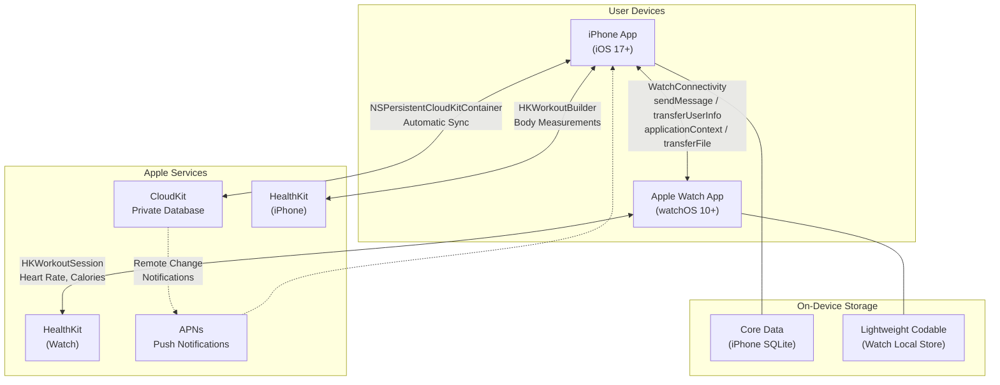
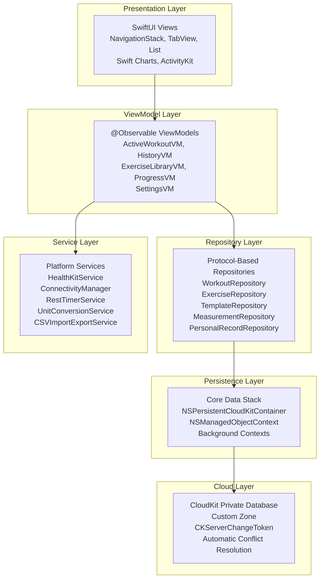
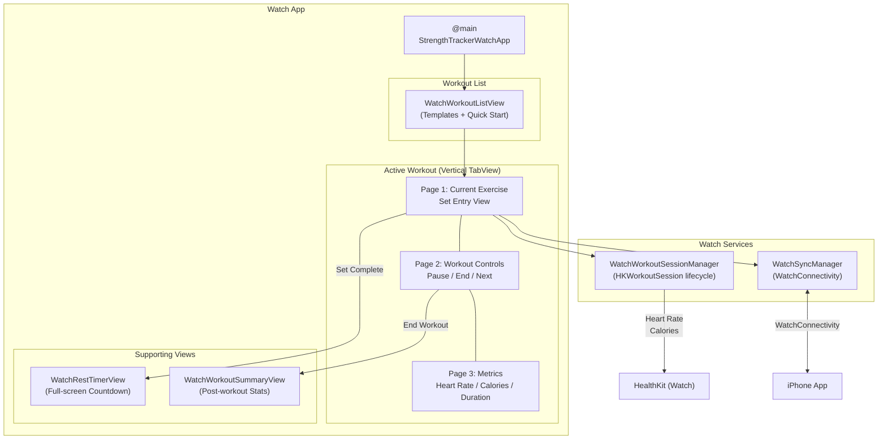
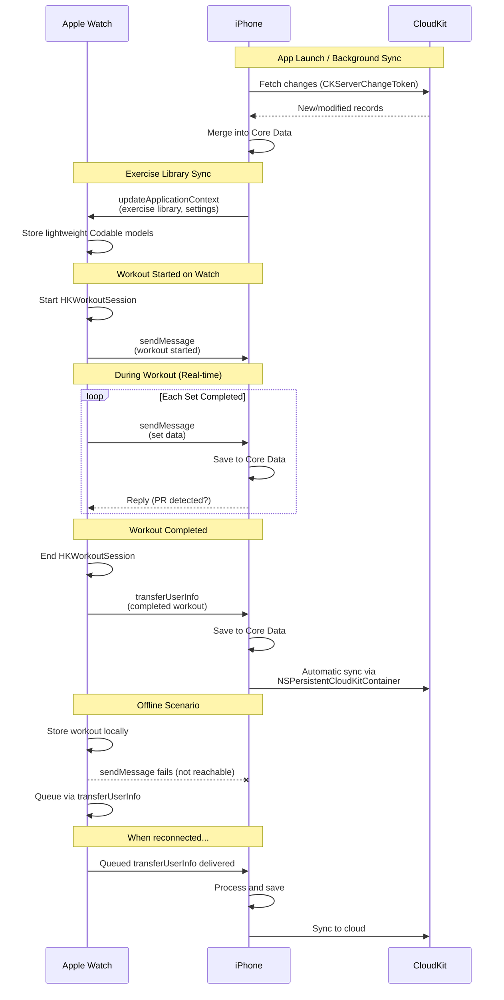
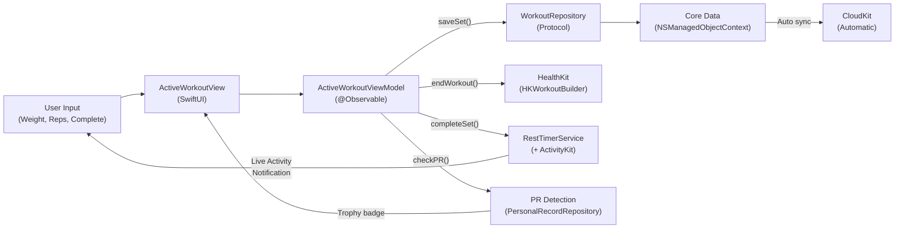
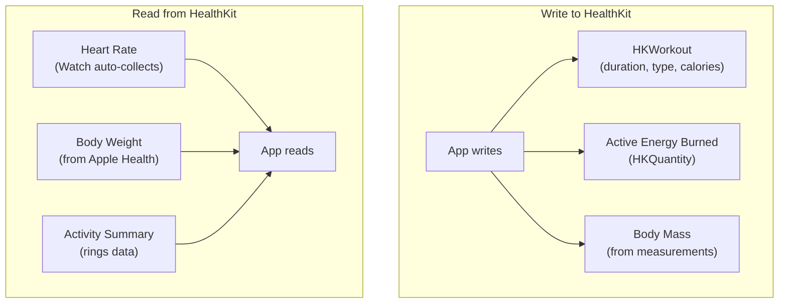
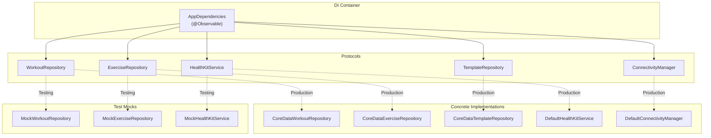

# System Architecture -- Strength Tracker (iOS + Apple Watch)

**Version:** 1.0
**Date:** January 2026
**Status:** Approved for implementation

---

## 1. System Overview

Strength Tracker is a native Apple-platform workout logging application targeting iOS 17+ and watchOS 10+. The system comprises an iPhone app, a standalone Apple Watch app, and shared modules, with cloud sync via CloudKit and health data integration via HealthKit. There are zero runtime third-party dependencies.



---

## 2. Layer Architecture

The application follows a strict layered architecture with unidirectional dependencies. Each layer communicates only with the layer directly below it through protocol-defined interfaces.



### Layer Responsibilities

| Layer | Responsibility | Key Technologies |
|-------|---------------|-----------------|
| **Presentation** | UI rendering, user interaction, layout | SwiftUI, Swift Charts, ActivityKit, WidgetKit |
| **ViewModel** | State management, UI logic, data transformation | @Observable, async/await |
| **Repository** | Data access abstraction, CRUD operations, query composition | Protocol interfaces, Core Data fetch requests |
| **Service** | Platform integration, cross-cutting concerns | HealthKit, WatchConnectivity, UNNotifications |
| **Persistence** | Local storage, schema management, migration | Core Data, NSPersistentCloudKitContainer |
| **Cloud** | Cross-device sync, backup, conflict resolution | CloudKit private database |

---

## 3. Component Architecture -- iOS App

The iPhone app is organized into five feature modules, each containing its own views and view models. Shared modules provide cross-cutting data access and services.

```mermaid
graph TB
    subgraph "iOS App"
        TabBar["Root TabView"]

        subgraph "Workout Feature"
            WL["WorkoutListView<br/>(Templates + Quick Start)"]
            AW["ActiveWorkoutView<br/>(Set Logging)"]
            RT["RestTimerView<br/>(+ Live Activity)"]
            AE["AddExerciseView<br/>(Exercise Picker)"]
        end

        subgraph "History Feature"
            HL["WorkoutHistoryView<br/>(Reverse Chronological)"]
            CV["CalendarView<br/>(Monthly Dot View)"]
            WD["WorkoutDetailView<br/>(Full Workout Review)"]
        end

        subgraph "Exercises Feature"
            EL["ExerciseListView<br/>(Search + Filter)"]
            ED["ExerciseDetailView<br/>(Stats, PR History)"]
            CE["CreateExerciseView<br/>(Custom Exercises)"]
        end

        subgraph "Progress Feature"
            PD["ProgressDashboardView<br/>(Overview Stats)"]
            EC["ExerciseProgressChart<br/>(1RM, Volume, Weight)"]
            BW["BodyWeightChart<br/>(Measurements)"]
        end

        subgraph "Settings Feature"
            SV["SettingsView"]
            US["UnitsSettingView"]
            TS["TimerSettingView"]
        end

        TabBar --> WL
        TabBar --> HL
        TabBar --> EL
        TabBar --> PD
        TabBar --> SV
        WL --> AW
        AW --> RT
        AW --> AE
        HL --> WD
        HL --> CV
        EL --> ED
        EL --> CE
    end

    subgraph "Shared Modules"
        Repositories
        Services
        DomainModels["Domain Models"]
        CoreDataStack["Core Data Stack"]
    end

    AW --> Repositories
    AW --> Services
    HL --> Repositories
    EL --> Repositories
    PD --> Repositories
    SV --> Repositories
```



### iOS Tab Structure

| Tab | View | Primary ViewModel | Description |
|-----|------|-------------------|-------------|
| **Workout** | WorkoutListView | WorkoutListViewModel | Template grid, quick start, active workout |
| **History** | WorkoutHistoryView | WorkoutHistoryViewModel | Past workouts, calendar, search |
| **Exercises** | ExerciseListView | ExerciseLibraryViewModel | Browse, search, filter, favorites |
| **Progress** | ProgressDashboardView | ProgressViewModel | Charts, PRs, body measurements |
| **Profile** | SettingsView | SettingsViewModel | Units, timer, data export, HealthKit |

---

## 4. Component Architecture -- Watch App

The Watch app is a standalone SwiftUI application with its own entry point. It uses a vertical TabView for primary navigation during active workouts and communicates with the iPhone via WatchConnectivity.



### Watch Features vs iPhone Features

| Feature | iPhone | Watch |
|---------|--------|-------|
| Start workout from template | Yes | Yes |
| Quick start empty workout | Yes | Yes |
| Log sets (weight/reps) | Yes | Yes (Digital Crown) |
| Rest timer with haptics | Yes (+ Live Activity) | Yes (haptic tap) |
| View workout history | Yes | No |
| Exercise library / search | Yes | No (receive from iPhone) |
| Create custom exercises | Yes | No |
| Progress charts | Yes | No |
| Body measurements | Yes | No |
| Template creation/editing | Yes | No |
| PR detection and display | Yes | Yes (receive notification) |
| HealthKit workout recording | Yes (HKWorkoutBuilder) | Yes (HKWorkoutSession) |
| Heart rate monitoring | No (reads from Watch) | Yes (auto during session) |
| Settings | Yes | No (receive from iPhone) |

---

## 5. Sync Architecture

Data flows between three systems: iPhone, Apple Watch, and CloudKit. Each uses a different sync mechanism optimized for its use case.



### Sync Method Selection Matrix

| Data Type | Direction | Method | Rationale |
|-----------|-----------|--------|-----------|
| Active set completion | Watch to iPhone | `sendMessage` | Real-time UI update on iPhone; falls back to `transferUserInfo` if unreachable |
| Completed workout | Watch to iPhone | `transferUserInfo` | Guaranteed delivery even if iPhone app is not running |
| Exercise library | iPhone to Watch | `updateApplicationContext` | Latest-only; Watch needs current version, not history |
| User settings | iPhone to Watch | `updateApplicationContext` | Latest-only; small payload |
| Template list | iPhone to Watch | `updateApplicationContext` | Latest-only; replaced entirely on each update |
| Full database sync | iPhone to Watch | `transferFile` | Initial setup or recovery; up to 100MB |
| PR notification | iPhone to Watch | `sendMessage` | Real-time celebration on Watch |
| Complication data | iPhone to Watch | `transferCurrentComplicationUserInfo` | High-priority, limited to 50/day |
| All entities | iPhone to CloudKit | NSPersistentCloudKitContainer | Automatic, background, conflict-resolved |

---

## 6. Data Flow Diagrams

### 6.1 Workout Logging Data Flow (iPhone)



### 6.2 HealthKit Integration Data Flow



| HealthKit Type | Direction | When | Description |
|---------------|-----------|------|-------------|
| `HKWorkout` | Write | Workout ends | Workout session with duration, calories, activity type |
| `activeEnergyBurned` | Write | Workout ends | Calories burned during workout |
| `bodyMass` | Write | User enters measurement | Body weight from manual entry |
| `heartRate` | Read | During Watch workout | Auto-collected by HKWorkoutSession |
| `bodyMass` | Read | On demand | Sync body weight from Apple Health |
| `activitySummary` | Read | Dashboard view | Move/Exercise/Stand ring progress |

---

## 7. Project Structure

```
StrengthTracker/
|
|-- StrengthTracker.xcodeproj
|
|-- Shared/                              # Shared between iOS and watchOS targets
|   |-- Models/
|   |   |-- Domain/                      # Plain Swift value types
|   |   |   |-- Exercise.swift
|   |   |   |-- Workout.swift
|   |   |   |-- WorkoutSet.swift
|   |   |   |-- WorkoutTemplate.swift
|   |   |   |-- BodyMeasurement.swift
|   |   |   |-- PersonalRecord.swift
|   |   |   |-- Enums.swift             # MuscleGroup, ExerciseCategory, etc.
|   |   |-- CoreData/                    # Managed object subclasses
|   |   |   |-- StrengthTracker.xcdatamodeld
|   |   |   |-- CDExercise+Extensions.swift
|   |   |   |-- CDWorkout+Extensions.swift
|   |   |   |-- CDWorkoutExercise+Extensions.swift
|   |   |   |-- CDExerciseSet+Extensions.swift
|   |   |   |-- CDWorkoutTemplate+Extensions.swift
|   |   |   |-- CDTemplateExercise+Extensions.swift
|   |   |   |-- CDTemplateFolder+Extensions.swift
|   |   |   |-- CDBodyMeasurement+Extensions.swift
|   |   |   |-- CDPersonalRecord+Extensions.swift
|   |   |   |-- CDUserSettings+Extensions.swift
|   |   |-- Mappers/                     # Core Data <-> Domain conversion
|   |       |-- WorkoutMapper.swift
|   |       |-- ExerciseMapper.swift
|   |       |-- TemplateMapper.swift
|   |
|   |-- Repositories/                    # Protocol definitions + Core Data impls
|   |   |-- Protocols/
|   |   |   |-- WorkoutRepository.swift
|   |   |   |-- ExerciseRepository.swift
|   |   |   |-- TemplateRepository.swift
|   |   |   |-- MeasurementRepository.swift
|   |   |   |-- PersonalRecordRepository.swift
|   |   |-- CoreData/
|   |       |-- CoreDataWorkoutRepository.swift
|   |       |-- CoreDataExerciseRepository.swift
|   |       |-- CoreDataTemplateRepository.swift
|   |       |-- CoreDataMeasurementRepository.swift
|   |       |-- CoreDataPersonalRecordRepository.swift
|   |
|   |-- Services/
|   |   |-- HealthKitService.swift
|   |   |-- ConnectivityManager.swift
|   |   |-- PersistenceController.swift
|   |   |-- RestTimerService.swift
|   |   |-- UnitConversionService.swift
|   |   |-- PRDetectionService.swift
|   |   |-- CSVImportExportService.swift
|   |
|   |-- Utilities/
|       |-- Constants.swift
|       |-- DateFormatters.swift
|       |-- OneRepMaxCalculator.swift
|       |-- Extensions/
|
|-- iOS/                                 # iPhone app target
|   |-- App/
|   |   |-- StrengthTrackerApp.swift
|   |   |-- AppDependencies.swift
|   |   |-- ContentView.swift
|   |-- Features/
|   |   |-- Workout/
|   |   |-- History/
|   |   |-- ExerciseLibrary/
|   |   |-- Progress/
|   |   |-- Settings/
|   |-- Components/
|   |-- Widgets/
|   |-- LiveActivity/
|
|-- WatchApp/                            # watchOS app target (standalone)
|   |-- App/
|   |   |-- StrengthTrackerWatchApp.swift
|   |   |-- WatchAppDependencies.swift
|   |-- Features/
|   |   |-- WorkoutList/
|   |   |-- ActiveWorkout/
|   |   |-- Summary/
|   |-- ViewModels/
|   |   |-- WatchWorkoutSessionManager.swift
|   |-- Components/
|   |-- Complications/
|
|-- Tests/
|   |-- UnitTests/
|   |-- IntegrationTests/
|   |-- UITests/
|
|-- Resources/
    |-- ExerciseLibrary.json
    |-- Assets.xcassets
    |-- Localizable.strings
```

---

## 8. Dependency Injection

The app uses protocol-based dependency injection with SwiftUI's Environment system. No DI framework is required.



The `AppDependencies` container is injected at the root of the SwiftUI view hierarchy via `.environment()` and flows down to all child views that need it.

---

## 9. Concurrency Model

The application uses Swift 6.0 structured concurrency throughout.

| Context | Pattern | Rationale |
|---------|---------|-----------|
| View Models | `@MainActor @Observable` | UI state must update on main thread |
| Repository reads | `async throws` methods | Non-blocking data fetching |
| Repository writes | `performBackgroundTask` | Avoid blocking main context |
| HealthKit queries | `async` wrappers over HK callbacks | Modern API surface |
| WatchConnectivity | `@MainActor` delegate methods | Delegate callbacks arrive on arbitrary queues; dispatch to main |
| CloudKit sync | Automatic (NSPersistentCloudKitContainer) | No manual management needed |
| Rest timer | `AsyncTimerSequence` or `Timer.publish` | Continuous UI updates |
| CSV import | Background task with progress | Large imports must not block UI |

---

## 10. Security and Privacy

| Concern | Approach |
|---------|----------|
| Data at rest | Core Data SQLite encrypted via iOS Data Protection (NSFileProtectionComplete) |
| CloudKit data | Encrypted in transit and at rest by Apple; private database accessible only to the user's iCloud account |
| HealthKit | Encrypted at rest by iOS; per-type authorization; excluded from iCloud backup |
| No user accounts | Authentication is implicit via iCloud/Apple ID; no username/password |
| No server | Zero server infrastructure; no attack surface beyond device and iCloud |
| Export data | CSV export stored temporarily; user controls sharing |
| Watch communication | WatchConnectivity is encrypted by the OS; on-device only |

---

## 11. Key Architectural Decisions Summary

| # | Decision | Choice | Rationale |
|---|----------|--------|-----------|
| 1 | UI Framework | SwiftUI | Shared codebase with watchOS; declarative; Widget/LiveActivity support |
| 2 | Architecture Pattern | MVVM + Repository | Right complexity for scope; native to SwiftUI with @Observable |
| 3 | Persistence | Core Data + NSPersistentCloudKitContainer | Mature CloudKit sync; proven at scale; reliable migrations |
| 4 | Cloud Sync | CloudKit private database | Free; serverless; no user account creation needed |
| 5 | Device Sync | WatchConnectivity | Real-time during workouts; queued for reliability |
| 6 | Health Integration | HealthKit | Required for Activity Rings, heart rate, workout recording |
| 7 | Observation | @Observable (iOS 17+) | Less boilerplate than ObservableObject; fine-grained updates |
| 8 | Concurrency | Swift 6.0 async/await | Type-safe concurrency; eliminates callback hell |
| 9 | Charts | Swift Charts | Native; no dependency; deep SwiftUI integration |
| 10 | Live Activity | ActivityKit | Rest timer on lock screen / Dynamic Island |
| 11 | Dependencies | Zero runtime third-party | Reduces maintenance burden; no supply chain risk |
| 12 | Watch Architecture | Standalone + companion features | Works independently at gym; syncs when iPhone available |
| 13 | Minimum Targets | iOS 17.0 / watchOS 10.0 | Required for @Observable, modern navigation, vertical TabView |
| 14 | DI Approach | Protocol + Environment injection | Testable; lightweight; idiomatic SwiftUI |
