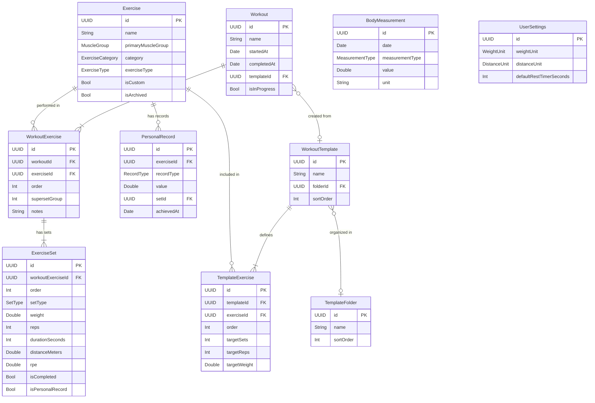

# Data Model Architecture -- Strength Tracker (iOS + Apple Watch)

## Table of Contents

1. [Industry Research](#1-industry-research)
2. [Core Entities](#2-core-entities)
3. [Exercise Categories and Taxonomies](#3-exercise-categories-and-taxonomies)
4. [Entity Relationships](#4-entity-relationships)
5. [Sync and CloudKit Considerations](#5-sync-and-cloudkit-considerations)
6. [Pre-populated Data](#6-pre-populated-data)
7. [Computed Properties and Derived Data](#7-computed-properties-and-derived-data)
8. [Apple Watch Data Subset](#8-apple-watch-data-subset)
9. [SwiftData / Core Data Mapping](#9-swiftdata--core-data-mapping)

---

## 1. Industry Research

### 1.1 Strong App Data Structure

Strong is the leading iOS workout tracker. Analysis of its CSV export format reveals the following flat-row structure where each row represents a single set:

```
Date,Workout Name,Exercise Name,Set Order,Weight,Weight Unit,Reps,RPE,
Distance,Distance Unit,Seconds,Notes,Workout Notes,Workout Duration
```

Key observations from Strong's data model:

- **Flat denormalization in exports**: Each CSV row is a single set, with workout and exercise metadata duplicated across rows. This implies a normalized internal model with Workout -> WorkoutExercise -> ExerciseSet hierarchy.
- **Set types**: Strong supports Normal, Warm Up, Drop Set, and Failure set types (encoded in the export as a separate column or inferred).
- **RPE tracking**: Rate of Perceived Exertion (1-10 scale) is a per-set field.
- **Duration-based exercises**: The `Seconds` column supports planks, holds, and cardio exercises.
- **Distance tracking**: Separate distance/distance-unit columns for running, rowing, etc.
- **Weight units**: Per-row unit tracking (kg/lbs) supports mixed-unit scenarios.
- **Workout duration**: Stored as total seconds at the workout level.
- **Templates/Routines**: Strong calls these "Routines" -- reusable workout blueprints that pre-populate exercises and target sets/reps.

### 1.2 Hevy App Data Structure

Hevy uses a similar CSV export structure:

```
title,start_time,end_time,description,exercise_title,superset_id,
exercise_notes,set_index,set_type,weight_kg,reps,distance_km,
duration_seconds,rpe
```

Notable differences from Strong:
- **Superset support**: Explicit `superset_id` groups exercises performed back-to-back.
- **Start/end time**: Rather than duration, Hevy stores both timestamps.
- **Set types**: "normal", "warmup", "dropset", "failure" as string values.

### 1.3 FitNotes Export Structure

```
Date,Exercise,Category,Weight,Weight Unit,Reps,Distance,Distance Unit,Time
```

Simpler model -- no RPE, no set types, no superset grouping.

### 1.4 Common Patterns Across Apps

| Feature | Strong | Hevy | FitNotes | JEFIT |
|---------|--------|------|----------|-------|
| Set types (warmup/drop/failure) | Yes | Yes | No | Yes |
| RPE per set | Yes | Yes | No | No |
| Supersets | No | Yes | No | Yes |
| Rest timer data | Yes | Yes | No | Yes |
| Exercise instructions | Yes | Yes | No | Yes |
| Custom exercises | Yes | Yes | Yes | Yes |
| Workout templates | Yes (Routines) | Yes (Routines) | No | Yes (Plans) |
| Body measurements | Yes | Yes | No | Yes |
| Personal records | Auto-detected | Auto-detected | No | Auto-detected |
| Apple Watch companion | Yes | Yes | No | No |
| CloudKit sync | Yes | No | No | No |

### 1.5 Design Decisions for Our Model

Based on this research, the data model should:

1. Use a **normalized relational structure** (Workout -> WorkoutExercise -> ExerciseSet) rather than flat rows.
2. Support **all set types**: normal, warmup, dropset, failure, and rest-pause.
3. Include **RPE** as an optional per-set field.
4. Support **supersets** via a grouping mechanism on WorkoutExercise.
5. Handle **multiple measurement types**: weight+reps, duration, distance, bodyweight-reps.
6. Track **rest periods** between sets.
7. Use **UUID primary keys** and **timestamp-based conflict resolution** for CloudKit sync.
8. Maintain a **lightweight Watch subset** for active workout tracking.

---

## 2. Core Entities

### 2.1 Exercise

The exercise definition -- the "what" being performed. This is a reference/library entity.

| Field | Type | Required | Description |
|-------|------|----------|-------------|
| `id` | UUID | Yes | Primary key |
| `name` | String | Yes | Display name (e.g., "Bench Press") |
| `primaryMuscleGroup` | MuscleGroup (enum) | Yes | Primary target muscle |
| `secondaryMuscleGroups` | [MuscleGroup] | No | Secondary muscles worked |
| `category` | ExerciseCategory (enum) | Yes | Barbell, Dumbbell, Machine, etc. |
| `exerciseType` | ExerciseType (enum) | Yes | Weighted, Bodyweight, Cardio, Duration, etc. |
| `instructions` | String | No | How to perform the exercise |
| `isCustom` | Bool | Yes | User-created vs. pre-populated |
| `isArchived` | Bool | Yes | Soft-hidden from exercise picker |
| `isDeleted` | Bool | Yes | Soft delete for sync |
| `sortOrder` | Int | No | User-defined sort preference |
| `createdAt` | Date | Yes | Creation timestamp |
| `modifiedAt` | Date | Yes | Last modification timestamp |

**Rationale**: Separating `primaryMuscleGroup` from `category` (equipment) allows filtering like "show me all chest exercises" independently from "show me all barbell exercises." The `exerciseType` enum drives which fields are relevant per set (weight+reps vs. duration vs. distance).

### 2.2 Workout

A single completed (or in-progress) workout session.

| Field | Type | Required | Description |
|-------|------|----------|-------------|
| `id` | UUID | Yes | Primary key |
| `name` | String | Yes | Display name (e.g., "Push Day", "Morning Workout") |
| `startedAt` | Date | Yes | When the workout began |
| `completedAt` | Date | No | When the workout ended (nil if in progress) |
| `notes` | String | No | General workout notes |
| `templateId` | UUID | No | Reference to originating template |
| `isInProgress` | Bool | Yes | Active workout flag |
| `isDeleted` | Bool | Yes | Soft delete for sync |
| `createdAt` | Date | Yes | Record creation timestamp |
| `modifiedAt` | Date | Yes | Last modification timestamp |

**Rationale**: Storing both `startedAt` and `completedAt` (rather than a duration) allows accurate duration computation and handles paused/resumed workouts. The `templateId` is a loose reference (not a hard FK) so templates can be deleted without affecting historical workouts.

### 2.3 WorkoutExercise

A specific exercise instance within a workout. This is the join entity between Workout and Exercise, with ordering and grouping metadata.

| Field | Type | Required | Description |
|-------|------|----------|-------------|
| `id` | UUID | Yes | Primary key |
| `workoutId` | UUID | Yes | FK to Workout |
| `exerciseId` | UUID | Yes | FK to Exercise |
| `order` | Int | Yes | Position within the workout (0-indexed) |
| `supersetGroup` | Int | No | Superset grouping identifier (nil = no superset) |
| `notes` | String | No | Exercise-specific notes for this workout |
| `restTimerSeconds` | Int | No | Override rest timer for this exercise |
| `isDeleted` | Bool | Yes | Soft delete for sync |
| `createdAt` | Date | Yes | Record creation timestamp |
| `modifiedAt` | Date | Yes | Last modification timestamp |

**Rationale**: The `supersetGroup` integer groups exercises performed back-to-back. Exercises sharing the same non-nil `supersetGroup` value within a workout are supersetted. The `order` field allows reordering exercises via drag-and-drop.

### 2.4 ExerciseSet

A single set within a workout exercise. This is the most granular tracking unit.

| Field | Type | Required | Description |
|-------|------|----------|-------------|
| `id` | UUID | Yes | Primary key |
| `workoutExerciseId` | UUID | Yes | FK to WorkoutExercise |
| `order` | Int | Yes | Position within the exercise (0-indexed) |
| `setType` | SetType (enum) | Yes | Normal, Warmup, Dropset, Failure, RestPause |
| `weight` | Double | No | Weight used (in user's preferred unit) |
| `reps` | Int | No | Number of repetitions |
| `durationSeconds` | Int | No | Duration for timed exercises |
| `distanceMeters` | Double | No | Distance for cardio exercises |
| `rpe` | Double | No | Rate of Perceived Exertion (1.0-10.0, half-step) |
| `isCompleted` | Bool | Yes | Whether the set was actually performed |
| `isPersonalRecord` | Bool | Yes | Flagged as PR at time of completion |
| `completedAt` | Date | No | Timestamp when set was marked complete |
| `isDeleted` | Bool | Yes | Soft delete for sync |
| `createdAt` | Date | Yes | Record creation timestamp |
| `modifiedAt` | Date | Yes | Last modification timestamp |

**Rationale**: Different exercise types use different field combinations:
- **Weighted exercises**: `weight` + `reps`
- **Bodyweight exercises**: `reps` only (or `weight` for added weight)
- **Duration exercises** (plank, hold): `durationSeconds`
- **Cardio exercises**: `distanceMeters` + `durationSeconds`
- **Weighted cardio** (farmer's walk): `weight` + `distanceMeters`

The `isCompleted` flag distinguishes planned sets (from templates) from actually-performed sets. `isPersonalRecord` is stamped at completion time to allow historical PR badges.

### 2.5 WorkoutTemplate

A reusable workout plan (called "Routine" in Strong).

| Field | Type | Required | Description |
|-------|------|----------|-------------|
| `id` | UUID | Yes | Primary key |
| `name` | String | Yes | Template name (e.g., "Push Day A") |
| `notes` | String | No | Template description |
| `sortOrder` | Int | Yes | Position in template list |
| `folderId` | UUID | No | FK to TemplateFolder for organization |
| `lastUsedAt` | Date | No | When template was last started as workout |
| `timesUsed` | Int | Yes | Number of times this template was used |
| `isDeleted` | Bool | Yes | Soft delete for sync |
| `createdAt` | Date | Yes | Record creation timestamp |
| `modifiedAt` | Date | Yes | Last modification timestamp |

### 2.6 TemplateExercise

An exercise slot within a template, with target sets.

| Field | Type | Required | Description |
|-------|------|----------|-------------|
| `id` | UUID | Yes | Primary key |
| `templateId` | UUID | Yes | FK to WorkoutTemplate |
| `exerciseId` | UUID | Yes | FK to Exercise |
| `order` | Int | Yes | Position within the template |
| `supersetGroup` | Int | No | Superset grouping |
| `notes` | String | No | Default notes for this exercise |
| `restTimerSeconds` | Int | No | Default rest timer |
| `targetSets` | Int | Yes | Number of target sets |
| `targetReps` | Int | No | Target reps per set |
| `targetWeight` | Double | No | Target weight (or last-used weight) |
| `targetDurationSeconds` | Int | No | Target duration for timed exercises |
| `targetDistanceMeters` | Double | No | Target distance for cardio |
| `isDeleted` | Bool | Yes | Soft delete for sync |
| `createdAt` | Date | Yes | Record creation timestamp |
| `modifiedAt` | Date | Yes | Last modification timestamp |

**Rationale**: Templates store *targets* rather than actual performance. When a workout is started from a template, the system creates WorkoutExercise and ExerciseSet records pre-populated from these targets, with the most recent actual weights auto-filled where available.

### 2.7 TemplateFolder

Organizational grouping for templates (e.g., "PPL Program", "5/3/1").

| Field | Type | Required | Description |
|-------|------|----------|-------------|
| `id` | UUID | Yes | Primary key |
| `name` | String | Yes | Folder name |
| `sortOrder` | Int | Yes | Display position |
| `isDeleted` | Bool | Yes | Soft delete for sync |
| `createdAt` | Date | Yes | Record creation timestamp |
| `modifiedAt` | Date | Yes | Last modification timestamp |

### 2.8 BodyMeasurement

Tracked body metrics over time.

| Field | Type | Required | Description |
|-------|------|----------|-------------|
| `id` | UUID | Yes | Primary key |
| `date` | Date | Yes | Measurement date |
| `measurementType` | MeasurementType (enum) | Yes | Weight, BodyFat, Chest, Waist, etc. |
| `value` | Double | Yes | Measurement value |
| `unit` | String | Yes | Unit of measurement |
| `notes` | String | No | Optional notes |
| `isDeleted` | Bool | Yes | Soft delete for sync |
| `createdAt` | Date | Yes | Record creation timestamp |
| `modifiedAt` | Date | Yes | Last modification timestamp |

### 2.9 PersonalRecord

Cached personal records for quick lookup and historical tracking.

| Field | Type | Required | Description |
|-------|------|----------|-------------|
| `id` | UUID | Yes | Primary key |
| `exerciseId` | UUID | Yes | FK to Exercise |
| `recordType` | RecordType (enum) | Yes | OneRepMax, MaxWeight, MaxReps, MaxVolume, BestPace |
| `value` | Double | Yes | The record value |
| `setId` | UUID | No | FK to the ExerciseSet that achieved this PR |
| `achievedAt` | Date | Yes | When the record was set |
| `isDeleted` | Bool | Yes | Soft delete for sync |
| `createdAt` | Date | Yes | Record creation timestamp |
| `modifiedAt` | Date | Yes | Last modification timestamp |

**Rationale**: While PRs can be computed on-the-fly by scanning all historical sets, caching them in a dedicated table enables instant PR badge display, timeline views, and prevents expensive full-table scans. Records are recalculated when sets are edited or deleted.

### 2.10 UserSettings

Global user preferences (single-row table).

| Field | Type | Required | Description |
|-------|------|----------|-------------|
| `id` | UUID | Yes | Primary key |
| `weightUnit` | WeightUnit (enum) | Yes | kg or lbs (default: lbs) |
| `distanceUnit` | DistanceUnit (enum) | Yes | km or miles |
| `defaultRestTimerSeconds` | Int | Yes | Default rest timer (default: 90) |
| `autoStartRestTimer` | Bool | Yes | Auto-start timer after completing set |
| `showRPE` | Bool | Yes | Whether RPE column is visible |
| `autoDetectPRs` | Bool | Yes | Automatically flag personal records |
| `theme` | String | Yes | UI theme preference |
| `modifiedAt` | Date | Yes | Last modification timestamp |

---

## 3. Exercise Categories and Taxonomies

### 3.1 Muscle Groups (MuscleGroup enum)

```
chest
back
shoulders
biceps
triceps
forearms
core
quadriceps
hamstrings
glutes
calves
adductors
abductors
traps
lats
fullBody
cardio
other
```

**Mapping to display names**:

| Enum Value | Display Name | Common Aliases |
|------------|--------------|----------------|
| `chest` | Chest | Pectorals, Pecs |
| `back` | Back | Upper Back, Mid Back |
| `shoulders` | Shoulders | Delts, Deltoids |
| `biceps` | Biceps | Bis |
| `triceps` | Triceps | Tris |
| `forearms` | Forearms | Grip |
| `core` | Core | Abs, Abdominals, Obliques |
| `quadriceps` | Quadriceps | Quads |
| `hamstrings` | Hamstrings | Hams |
| `glutes` | Glutes | Glute, Butt |
| `calves` | Calves | Calf |
| `adductors` | Adductors | Inner Thigh |
| `abductors` | Abductors | Outer Thigh, Hip |
| `traps` | Traps | Trapezius |
| `lats` | Lats | Latissimus Dorsi |
| `fullBody` | Full Body | Compound |
| `cardio` | Cardio | Cardiovascular |
| `other` | Other | Misc |

### 3.2 Exercise Category / Equipment (ExerciseCategory enum)

```
barbell
dumbbell
machine
cable
bodyweight
smithMachine
kettlebell
resistanceBand
plate
medicineBall
exerciseBall
trx
landmine
trapBar
ezBar
other
```

### 3.3 Exercise Type (ExerciseType enum)

Determines which fields are relevant for each set:

| Enum Value | Primary Fields | Secondary Fields | Examples |
|------------|---------------|-----------------|----------|
| `weightedReps` | weight, reps | rpe | Bench Press, Squat |
| `bodyweightReps` | reps | weight (added) | Pull-ups, Push-ups |
| `duration` | durationSeconds | weight | Plank, Wall Sit |
| `cardio` | distanceMeters, durationSeconds | -- | Running, Cycling |
| `weightedCardio` | weight, distanceMeters | durationSeconds | Farmer's Walk |

### 3.4 Set Type (SetType enum)

```
normal       -- Standard working set
warmup       -- Warm-up set (excluded from volume calculations)
dropset      -- Reduced weight continuation set
failure      -- Set performed to muscular failure
restPause    -- Brief rest then continued reps
```

### 3.5 Measurement Type (MeasurementType enum)

```
bodyWeight
bodyFat
chest
leftArm
rightArm
leftForearm
rightForearm
waist
hips
leftThigh
rightThigh
leftCalf
rightCalf
shoulders
neck
```

### 3.6 Record Type (RecordType enum)

```
estimatedOneRepMax   -- Highest calculated 1RM
maxWeight            -- Heaviest weight lifted (any reps)
maxReps              -- Most reps at any weight
maxVolume            -- Highest single-set volume (weight x reps)
maxTotalVolume       -- Highest total volume in one workout for this exercise
bestPace             -- Fastest pace (distance/time) for cardio
longestDuration      -- Longest single duration for timed exercises
longestDistance       -- Longest single distance for cardio
```

---

## 4. Entity Relationships

### 4.1 Entity Relationship Diagram (Mermaid)



### 4.2 Relationship Details

| Parent | Child | Type | Cascade Rule | Description |
|--------|-------|------|--------------|-------------|
| Workout | WorkoutExercise | One-to-Many | Cascade Delete | Deleting a workout deletes all its exercises |
| WorkoutExercise | ExerciseSet | One-to-Many | Cascade Delete | Deleting a workout exercise deletes all its sets |
| Exercise | WorkoutExercise | One-to-Many | Deny Delete | Cannot delete exercise if used in workouts; must archive instead |
| Exercise | TemplateExercise | One-to-Many | Cascade Delete | Deleting exercise removes it from templates |
| Exercise | PersonalRecord | One-to-Many | Cascade Delete | Deleting exercise removes its PR records |
| WorkoutTemplate | TemplateExercise | One-to-Many | Cascade Delete | Deleting template deletes its exercise slots |
| WorkoutTemplate | Workout | One-to-Many (loose) | Nullify | Deleting template sets workout.templateId to nil |
| TemplateFolder | WorkoutTemplate | One-to-Many | Nullify | Deleting folder moves templates to "unfiled" |

### 4.3 Indexes

The following indexes optimize common query patterns:

| Entity | Index Fields | Purpose |
|--------|-------------|---------|
| Workout | `startedAt DESC` | Timeline/history view |
| Workout | `isInProgress` | Finding active workout |
| Workout | `templateId` | Finding workouts from a template |
| WorkoutExercise | `workoutId, order` | Ordered exercises within workout |
| WorkoutExercise | `exerciseId` | Exercise history lookup |
| ExerciseSet | `workoutExerciseId, order` | Ordered sets within exercise |
| ExerciseSet | `isCompleted` | Filtering completed sets |
| Exercise | `name` | Search by name |
| Exercise | `primaryMuscleGroup` | Filter by muscle group |
| Exercise | `category` | Filter by equipment |
| Exercise | `isCustom` | Separate custom from default |
| BodyMeasurement | `date DESC, measurementType` | Timeline for specific measurement |
| PersonalRecord | `exerciseId, recordType` | PR lookup per exercise |
| PersonalRecord | `achievedAt DESC` | Recent PRs timeline |

---

## 5. Sync and CloudKit Considerations

### 5.1 UUID-Based Primary Keys

All entities use `UUID` primary keys (generated client-side via `UUID()`) rather than auto-incrementing integers. This is mandatory for CloudKit sync because:

- Records can be created on any device (iPhone, Watch, iPad) independently.
- No central authority is needed to assign IDs.
- Merge conflicts on ID collision are effectively impossible (UUID v4 collision probability is negligible).

### 5.2 Timestamp-Based Conflict Resolution

Every entity includes:

```swift
@Attribute var createdAt: Date    // Set once at creation, never modified
@Attribute var modifiedAt: Date   // Updated on every change
```

**Conflict resolution strategy** (last-writer-wins with field-level merge):

1. When CloudKit reports a conflict, compare `modifiedAt` timestamps.
2. For simple fields, the record with the later `modifiedAt` wins.
3. For collections (e.g., sets within an exercise), merge by UUID -- sets present in either version are kept, with per-set `modifiedAt` used for field conflicts.
4. Deleted records (see soft delete below) always win over modifications with earlier timestamps.

### 5.3 Soft Delete Support

Every entity includes:

```swift
@Attribute var isDeleted: Bool = false
```

**Why soft delete instead of hard delete**:

- A device that is offline when a delete occurs needs to know the record was deleted.
- Hard deletes would cause the record to reappear when the offline device syncs.
- Soft-deleted records are excluded from all queries via a predicate filter.
- A background cleanup task permanently removes soft-deleted records older than 30 days.

**Deletion flow**:
1. User deletes a record -> `isDeleted = true`, `modifiedAt = now`.
2. CloudKit syncs the tombstone to all devices.
3. All devices filter out `isDeleted == true` from UI queries.
4. After 30 days, a maintenance task hard-deletes the tombstone.

### 5.4 CloudKit Schema Mapping

| SwiftData Entity | CloudKit Record Type | Zone |
|------------------|---------------------|------|
| Exercise | `CD_Exercise` | Private |
| Workout | `CD_Workout` | Private |
| WorkoutExercise | `CD_WorkoutExercise` | Private |
| ExerciseSet | `CD_ExerciseSet` | Private |
| WorkoutTemplate | `CD_WorkoutTemplate` | Private |
| TemplateExercise | `CD_TemplateExercise` | Private |
| TemplateFolder | `CD_TemplateFolder` | Private |
| BodyMeasurement | `CD_BodyMeasurement` | Private |
| PersonalRecord | `CD_PersonalRecord` | Private |
| UserSettings | `CD_UserSettings` | Private |

All records use the **private database** with a **custom zone** (`com.app.strength-tracker`) for atomic commits and efficient change tracking via `CKServerChangeToken`.

### 5.5 Sync Optimization

- **Batch sync**: Group related changes (e.g., completing a workout generates ~20-50 records) into a single `CKModifyRecordsOperation`.
- **Incremental fetch**: Use `CKFetchRecordZoneChangesOperation` with stored server change tokens.
- **Conflict handler**: Implement `CKModifyRecordsOperation.perRecordCompletionBlock` to handle `.serverRecordChanged` errors with the merge strategy above.

---

## 6. Pre-populated Data

### 6.1 Default Exercise Library

The app ships with approximately 200+ exercises. Below is the categorized list of the most common exercises:

#### Chest

| Exercise | Category | Type | Secondary Muscles |
|----------|----------|------|-------------------|
| Barbell Bench Press | Barbell | WeightedReps | Triceps, Shoulders |
| Incline Barbell Bench Press | Barbell | WeightedReps | Shoulders, Triceps |
| Decline Barbell Bench Press | Barbell | WeightedReps | Triceps |
| Dumbbell Bench Press | Dumbbell | WeightedReps | Triceps, Shoulders |
| Incline Dumbbell Bench Press | Dumbbell | WeightedReps | Shoulders, Triceps |
| Dumbbell Fly | Dumbbell | WeightedReps | -- |
| Incline Dumbbell Fly | Dumbbell | WeightedReps | Shoulders |
| Cable Crossover | Cable | WeightedReps | -- |
| Chest Dip | Bodyweight | BodyweightReps | Triceps, Shoulders |
| Push-up | Bodyweight | BodyweightReps | Triceps, Core |
| Machine Chest Press | Machine | WeightedReps | Triceps |
| Pec Deck | Machine | WeightedReps | -- |

#### Back

| Exercise | Category | Type | Secondary Muscles |
|----------|----------|------|-------------------|
| Barbell Row | Barbell | WeightedReps | Biceps, Core |
| Deadlift | Barbell | WeightedReps | Hamstrings, Glutes, Core |
| Pull-up | Bodyweight | BodyweightReps | Biceps |
| Chin-up | Bodyweight | BodyweightReps | Biceps |
| Lat Pulldown | Cable | WeightedReps | Biceps |
| Seated Cable Row | Cable | WeightedReps | Biceps |
| T-Bar Row | Barbell | WeightedReps | Biceps |
| Dumbbell Row | Dumbbell | WeightedReps | Biceps |
| Face Pull | Cable | WeightedReps | Shoulders |
| Rack Pull | Barbell | WeightedReps | Traps, Core |
| Inverted Row | Bodyweight | BodyweightReps | Biceps |

#### Shoulders

| Exercise | Category | Type | Secondary Muscles |
|----------|----------|------|-------------------|
| Overhead Press | Barbell | WeightedReps | Triceps |
| Dumbbell Shoulder Press | Dumbbell | WeightedReps | Triceps |
| Lateral Raise | Dumbbell | WeightedReps | -- |
| Front Raise | Dumbbell | WeightedReps | -- |
| Rear Delt Fly | Dumbbell | WeightedReps | -- |
| Arnold Press | Dumbbell | WeightedReps | Triceps |
| Upright Row | Barbell | WeightedReps | Traps |
| Cable Lateral Raise | Cable | WeightedReps | -- |
| Machine Shoulder Press | Machine | WeightedReps | Triceps |
| Barbell Shrug | Barbell | WeightedReps | Traps |

#### Biceps

| Exercise | Category | Type | Secondary Muscles |
|----------|----------|------|-------------------|
| Barbell Curl | Barbell | WeightedReps | Forearms |
| Dumbbell Curl | Dumbbell | WeightedReps | Forearms |
| Hammer Curl | Dumbbell | WeightedReps | Forearms |
| Preacher Curl | EZ Bar | WeightedReps | -- |
| Concentration Curl | Dumbbell | WeightedReps | -- |
| Cable Curl | Cable | WeightedReps | -- |
| Incline Dumbbell Curl | Dumbbell | WeightedReps | -- |
| EZ Bar Curl | EZ Bar | WeightedReps | Forearms |

#### Triceps

| Exercise | Category | Type | Secondary Muscles |
|----------|----------|------|-------------------|
| Tricep Pushdown | Cable | WeightedReps | -- |
| Overhead Tricep Extension | Cable | WeightedReps | -- |
| Skull Crusher | EZ Bar | WeightedReps | -- |
| Close-Grip Bench Press | Barbell | WeightedReps | Chest |
| Tricep Dip | Bodyweight | BodyweightReps | Chest, Shoulders |
| Diamond Push-up | Bodyweight | BodyweightReps | Chest |
| Dumbbell Kickback | Dumbbell | WeightedReps | -- |

#### Quadriceps

| Exercise | Category | Type | Secondary Muscles |
|----------|----------|------|-------------------|
| Barbell Squat | Barbell | WeightedReps | Glutes, Core |
| Front Squat | Barbell | WeightedReps | Core, Glutes |
| Leg Press | Machine | WeightedReps | Glutes |
| Leg Extension | Machine | WeightedReps | -- |
| Bulgarian Split Squat | Dumbbell | WeightedReps | Glutes |
| Goblet Squat | Dumbbell | WeightedReps | Core, Glutes |
| Hack Squat | Machine | WeightedReps | Glutes |
| Lunge | Dumbbell | WeightedReps | Glutes |
| Walking Lunge | Dumbbell | WeightedReps | Glutes |
| Step-up | Dumbbell | WeightedReps | Glutes |

#### Hamstrings

| Exercise | Category | Type | Secondary Muscles |
|----------|----------|------|-------------------|
| Romanian Deadlift | Barbell | WeightedReps | Glutes, Back |
| Leg Curl | Machine | WeightedReps | -- |
| Stiff-Leg Deadlift | Barbell | WeightedReps | Glutes |
| Good Morning | Barbell | WeightedReps | Back, Glutes |
| Nordic Hamstring Curl | Bodyweight | BodyweightReps | -- |
| Dumbbell Romanian Deadlift | Dumbbell | WeightedReps | Glutes |

#### Glutes

| Exercise | Category | Type | Secondary Muscles |
|----------|----------|------|-------------------|
| Hip Thrust | Barbell | WeightedReps | Hamstrings |
| Glute Bridge | Bodyweight | BodyweightReps | Hamstrings |
| Cable Pull-Through | Cable | WeightedReps | Hamstrings |
| Sumo Deadlift | Barbell | WeightedReps | Quads, Back |
| Kickback (Cable) | Cable | WeightedReps | -- |

#### Calves

| Exercise | Category | Type | Secondary Muscles |
|----------|----------|------|-------------------|
| Standing Calf Raise | Machine | WeightedReps | -- |
| Seated Calf Raise | Machine | WeightedReps | -- |
| Donkey Calf Raise | Machine | WeightedReps | -- |

#### Core

| Exercise | Category | Type | Secondary Muscles |
|----------|----------|------|-------------------|
| Plank | Bodyweight | Duration | -- |
| Crunch | Bodyweight | BodyweightReps | -- |
| Hanging Leg Raise | Bodyweight | BodyweightReps | -- |
| Ab Wheel Rollout | Bodyweight | BodyweightReps | -- |
| Cable Crunch | Cable | WeightedReps | -- |
| Russian Twist | Bodyweight | BodyweightReps | -- |
| Side Plank | Bodyweight | Duration | -- |
| Decline Sit-up | Bodyweight | BodyweightReps | -- |
| Woodchop | Cable | WeightedReps | -- |

#### Cardio

| Exercise | Category | Type | Secondary Muscles |
|----------|----------|------|-------------------|
| Treadmill Running | Machine | Cardio | -- |
| Cycling | Machine | Cardio | -- |
| Rowing Machine | Machine | Cardio | Back |
| Elliptical | Machine | Cardio | -- |
| Stair Climber | Machine | Cardio | -- |
| Jump Rope | Bodyweight | Cardio | Calves |

### 6.2 Default Workout Templates

#### Beginner Full Body A

```
1. Barbell Squat - 3 sets x 5 reps
2. Barbell Bench Press - 3 sets x 5 reps
3. Barbell Row - 3 sets x 5 reps
4. Overhead Press - 3 sets x 5 reps
5. Barbell Curl - 2 sets x 10 reps
```

#### Beginner Full Body B

```
1. Deadlift - 3 sets x 5 reps
2. Incline Dumbbell Bench Press - 3 sets x 8 reps
3. Lat Pulldown - 3 sets x 8 reps
4. Dumbbell Shoulder Press - 3 sets x 8 reps
5. Leg Curl - 2 sets x 10 reps
```

#### Push Day

```
1. Barbell Bench Press - 4 sets x 6 reps
2. Incline Dumbbell Bench Press - 3 sets x 10 reps
3. Overhead Press - 3 sets x 8 reps
4. Lateral Raise - 3 sets x 15 reps
5. Tricep Pushdown - 3 sets x 12 reps
6. Overhead Tricep Extension - 3 sets x 12 reps
```

#### Pull Day

```
1. Deadlift - 3 sets x 5 reps
2. Pull-up - 3 sets x 8 reps
3. Seated Cable Row - 3 sets x 10 reps
4. Face Pull - 3 sets x 15 reps
5. Barbell Curl - 3 sets x 10 reps
6. Hammer Curl - 2 sets x 12 reps
```

#### Leg Day

```
1. Barbell Squat - 4 sets x 6 reps
2. Romanian Deadlift - 3 sets x 8 reps
3. Leg Press - 3 sets x 10 reps
4. Leg Curl - 3 sets x 10 reps
5. Leg Extension - 3 sets x 12 reps
6. Standing Calf Raise - 4 sets x 15 reps
```

#### Upper Body

```
1. Barbell Bench Press - 4 sets x 6 reps
2. Barbell Row - 4 sets x 6 reps
3. Dumbbell Shoulder Press - 3 sets x 10 reps
4. Lat Pulldown - 3 sets x 10 reps
5. Dumbbell Curl - 2 sets x 12 reps
6. Tricep Pushdown - 2 sets x 12 reps
```

#### Lower Body

```
1. Barbell Squat - 4 sets x 5 reps
2. Romanian Deadlift - 3 sets x 8 reps
3. Bulgarian Split Squat - 3 sets x 10 reps
4. Leg Curl - 3 sets x 10 reps
5. Standing Calf Raise - 3 sets x 15 reps
6. Plank - 3 sets x 60 seconds
```

---

## 7. Computed Properties and Derived Data

### 7.1 Estimated 1RM Calculations

The Epley formula is the industry standard (also used by Strong):

```
Estimated 1RM = weight x (1 + reps / 30)
```

Alternative formulas for accuracy at different rep ranges:

| Formula | Equation | Best For |
|---------|----------|----------|
| Epley | `w * (1 + r/30)` | General use, moderate reps |
| Brzycki | `w * 36 / (37 - r)` | Lower rep ranges (1-10) |
| Lombardi | `w * r^0.10` | Higher rep ranges |
| O'Conner | `w * (1 + r/40)` | Conservative estimate |

**Implementation strategy**: Use Epley as the default. Only calculate for `r <= 12` reps (estimates become unreliable above 12 reps). Provide a setting to switch formula.

```swift
func estimatedOneRepMax(weight: Double, reps: Int) -> Double? {
    guard reps > 0, reps <= 12, weight > 0 else { return nil }
    if reps == 1 { return weight }
    return weight * (1.0 + Double(reps) / 30.0)
}
```

### 7.2 Volume Calculations

```swift
// Per-set volume (only for completed, non-warmup sets)
var setVolume: Double {
    guard isCompleted, setType != .warmup else { return 0 }
    return (weight ?? 0) * Double(reps ?? 0)
}

// Per-exercise volume (sum of all working sets)
var exerciseVolume: Double {
    sets.filter { $0.isCompleted && $0.setType != .warmup }
        .reduce(0) { $0 + $1.setVolume }
}

// Total workout volume
var totalVolume: Double {
    exercises.reduce(0) { $0 + $1.exerciseVolume }
}
```

### 7.3 Workout Duration

```swift
var duration: TimeInterval? {
    guard let start = startedAt, let end = completedAt else { return nil }
    return end.timeIntervalSince(start)
}

var formattedDuration: String {
    guard let dur = duration else { return "--" }
    let hours = Int(dur) / 3600
    let minutes = (Int(dur) % 3600) / 60
    if hours > 0 {
        return "\(hours)h \(minutes)m"
    }
    return "\(minutes)m"
}
```

### 7.4 Personal Record Detection

PR detection runs whenever a set is marked as completed. The system checks the following record types:

```swift
func detectPersonalRecords(for set: ExerciseSet, exercise: Exercise) -> [RecordType] {
    var newRecords: [RecordType] = []
    let history = fetchAllCompletedSets(for: exercise.id)

    // 1. Max Weight (any reps)
    if let weight = set.weight,
       weight > (history.compactMap(\.weight).max() ?? 0) {
        newRecords.append(.maxWeight)
    }

    // 2. Max Reps (at any weight)
    if let reps = set.reps,
       reps > (history.compactMap(\.reps).max() ?? 0) {
        newRecords.append(.maxReps)
    }

    // 3. Estimated 1RM
    if let e1rm = estimatedOneRepMax(weight: set.weight ?? 0, reps: set.reps ?? 0),
       e1rm > bestEstimated1RM(for: exercise.id) {
        newRecords.append(.estimatedOneRepMax)
    }

    // 4. Max Set Volume (weight x reps)
    if set.setVolume > (history.map(\.setVolume).max() ?? 0) {
        newRecords.append(.maxVolume)
    }

    return newRecords
}
```

### 7.5 Exercise Statistics (Computed on Read)

```swift
struct ExerciseStats {
    let totalSets: Int           // All-time completed sets
    let totalReps: Int           // All-time completed reps
    let totalVolume: Double      // All-time volume (kg/lbs)
    let bestWeight: Double?      // Heaviest weight used
    let bestReps: Int?           // Most reps in a single set
    let best1RM: Double?         // Best estimated 1RM
    let lastPerformed: Date?     // Most recent workout with this exercise
    let timesPerformed: Int      // Number of workouts containing this exercise
}
```

### 7.6 Workout Statistics (Computed on Read)

```swift
struct WorkoutStats {
    let totalSets: Int
    let totalReps: Int
    let totalVolume: Double
    let duration: TimeInterval
    let exerciseCount: Int
    let personalRecordsCount: Int
    let muscleGroupsWorked: Set<MuscleGroup>
}
```

---

## 8. Apple Watch Data Subset

### 8.1 Watch Requirements

The Apple Watch companion needs a minimal data subset for active workout tracking. It does NOT need full workout history or the complete exercise library.

### 8.2 Data Synced to Watch (via WatchConnectivity)

| Entity | Scope | Transfer Method |
|--------|-------|-----------------|
| Exercise (active) | Only non-archived, non-deleted exercises | Background transfer |
| WorkoutTemplate | All active templates + their exercises | Background transfer |
| Active Workout | Current in-progress workout only | Application context (real-time) |
| ExerciseSet (active) | Sets for the current workout only | Application context (real-time) |
| UserSettings | Full settings object | Application context |
| Recent PR data | Last 5 PRs per exercise being performed | User info transfer |

### 8.3 Watch-Specific Data Flow

```
iPhone                          Watch
  |                               |
  |--- Template List ------------>|  (background transfer on app launch)
  |--- Exercise Library --------->|  (background, filtered subset)
  |--- User Settings ------------>|  (application context)
  |                               |
  |  User starts workout on Watch |
  |<-- Workout Started -----------|  (application context)
  |                               |
  |  User completes a set         |
  |<-- Set Completed -------------|  (application context, real-time)
  |--- PR Notification ---------->|  (if PR detected on iPhone)
  |                               |
  |  User finishes workout        |
  |<-- Workout Completed ---------|  (application context)
  |                               |
  |  iPhone persists to CloudKit  |
  |  and detects PRs              |
```

### 8.4 Watch Data Models (Lightweight)

The Watch uses simplified `Codable` structs (not SwiftData) to minimize memory:

```swift
struct WatchExercise: Codable {
    let id: UUID
    let name: String
    let exerciseType: ExerciseType
    let category: ExerciseCategory
}

struct WatchTemplate: Codable {
    let id: UUID
    let name: String
    let exercises: [WatchTemplateExercise]
}

struct WatchTemplateExercise: Codable {
    let exerciseId: UUID
    let order: Int
    let targetSets: Int
    let targetReps: Int?
    let targetWeight: Double?
}

struct WatchActiveWorkout: Codable {
    let id: UUID
    let name: String
    let startedAt: Date
    let exercises: [WatchActiveExercise]
}

struct WatchActiveExercise: Codable {
    let id: UUID
    let exerciseId: UUID
    let order: Int
    let sets: [WatchActiveSet]
}

struct WatchActiveSet: Codable {
    let id: UUID
    let order: Int
    let setType: SetType
    let weight: Double?
    let reps: Int?
    let durationSeconds: Int?
    let isCompleted: Bool
}
```

### 8.5 Estimated Watch Data Size

| Data | Approximate Size | Frequency |
|------|-----------------|-----------|
| Exercise library (200 exercises) | ~40 KB | Once per day / on change |
| Template list (10 templates) | ~15 KB | Once per day / on change |
| Active workout (10 exercises, 40 sets) | ~8 KB | Real-time during workout |
| User settings | < 1 KB | On change |

Total Watch storage requirement: < 100 KB.

---

## 9. SwiftData / Core Data Mapping

### 9.1 SwiftData Model Declarations

The following shows how the entities map to SwiftData `@Model` classes:

```swift
import SwiftData

@Model
final class Exercise {
    @Attribute(.unique) var id: UUID
    var name: String
    var primaryMuscleGroup: MuscleGroup
    var secondaryMuscleGroups: [MuscleGroup]
    var category: ExerciseCategory
    var exerciseType: ExerciseType
    var instructions: String?
    var isCustom: Bool
    var isArchived: Bool
    var isDeleted: Bool
    var sortOrder: Int?
    var createdAt: Date
    var modifiedAt: Date

    @Relationship(deleteRule: .deny, inverse: \WorkoutExercise.exercise)
    var workoutExercises: [WorkoutExercise]

    @Relationship(deleteRule: .cascade, inverse: \TemplateExercise.exercise)
    var templateExercises: [TemplateExercise]

    @Relationship(deleteRule: .cascade, inverse: \PersonalRecord.exercise)
    var personalRecords: [PersonalRecord]
}

@Model
final class Workout {
    @Attribute(.unique) var id: UUID
    var name: String
    var startedAt: Date
    var completedAt: Date?
    var notes: String?
    var templateId: UUID?
    var isInProgress: Bool
    var isDeleted: Bool
    var createdAt: Date
    var modifiedAt: Date

    @Relationship(deleteRule: .cascade, inverse: \WorkoutExercise.workout)
    var exercises: [WorkoutExercise]
}

@Model
final class WorkoutExercise {
    @Attribute(.unique) var id: UUID
    var order: Int
    var supersetGroup: Int?
    var notes: String?
    var restTimerSeconds: Int?
    var isDeleted: Bool
    var createdAt: Date
    var modifiedAt: Date

    var workout: Workout?
    var exercise: Exercise?

    @Relationship(deleteRule: .cascade, inverse: \ExerciseSet.workoutExercise)
    var sets: [ExerciseSet]
}

@Model
final class ExerciseSet {
    @Attribute(.unique) var id: UUID
    var order: Int
    var setType: SetType
    var weight: Double?
    var reps: Int?
    var durationSeconds: Int?
    var distanceMeters: Double?
    var rpe: Double?
    var isCompleted: Bool
    var isPersonalRecord: Bool
    var completedAt: Date?
    var isDeleted: Bool
    var createdAt: Date
    var modifiedAt: Date

    var workoutExercise: WorkoutExercise?
}

@Model
final class WorkoutTemplate {
    @Attribute(.unique) var id: UUID
    var name: String
    var notes: String?
    var sortOrder: Int
    var lastUsedAt: Date?
    var timesUsed: Int
    var isDeleted: Bool
    var createdAt: Date
    var modifiedAt: Date

    var folder: TemplateFolder?

    @Relationship(deleteRule: .cascade, inverse: \TemplateExercise.template)
    var exercises: [TemplateExercise]
}

@Model
final class TemplateExercise {
    @Attribute(.unique) var id: UUID
    var order: Int
    var supersetGroup: Int?
    var notes: String?
    var restTimerSeconds: Int?
    var targetSets: Int
    var targetReps: Int?
    var targetWeight: Double?
    var targetDurationSeconds: Int?
    var targetDistanceMeters: Double?
    var isDeleted: Bool
    var createdAt: Date
    var modifiedAt: Date

    var template: WorkoutTemplate?
    var exercise: Exercise?
}

@Model
final class TemplateFolder {
    @Attribute(.unique) var id: UUID
    var name: String
    var sortOrder: Int
    var isDeleted: Bool
    var createdAt: Date
    var modifiedAt: Date

    @Relationship(deleteRule: .nullify, inverse: \WorkoutTemplate.folder)
    var templates: [WorkoutTemplate]
}

@Model
final class BodyMeasurement {
    @Attribute(.unique) var id: UUID
    var date: Date
    var measurementType: MeasurementType
    var value: Double
    var unit: String
    var notes: String?
    var isDeleted: Bool
    var createdAt: Date
    var modifiedAt: Date
}

@Model
final class PersonalRecord {
    @Attribute(.unique) var id: UUID
    var recordType: RecordType
    var value: Double
    var setId: UUID?
    var achievedAt: Date
    var isDeleted: Bool
    var createdAt: Date
    var modifiedAt: Date

    var exercise: Exercise?
}

@Model
final class UserSettings {
    @Attribute(.unique) var id: UUID
    var weightUnit: WeightUnit
    var distanceUnit: DistanceUnit
    var defaultRestTimerSeconds: Int
    var autoStartRestTimer: Bool
    var showRPE: Bool
    var autoDetectPRs: Bool
    var theme: String
    var modifiedAt: Date
}
```

### 9.2 Enum Definitions

```swift
enum MuscleGroup: String, Codable, CaseIterable {
    case chest, back, shoulders, biceps, triceps, forearms
    case core, quadriceps, hamstrings, glutes, calves
    case adductors, abductors, traps, lats
    case fullBody, cardio, other
}

enum ExerciseCategory: String, Codable, CaseIterable {
    case barbell, dumbbell, machine, cable, bodyweight
    case smithMachine, kettlebell, resistanceBand
    case plate, medicineBall, exerciseBall, trx
    case landmine, trapBar, ezBar, other
}

enum ExerciseType: String, Codable, CaseIterable {
    case weightedReps     // weight + reps
    case bodyweightReps   // reps (optional added weight)
    case duration         // seconds
    case cardio           // distance + duration
    case weightedCardio   // weight + distance
}

enum SetType: String, Codable, CaseIterable {
    case normal, warmup, dropset, failure, restPause
}

enum MeasurementType: String, Codable, CaseIterable {
    case bodyWeight, bodyFat
    case chest, leftArm, rightArm, leftForearm, rightForearm
    case waist, hips, leftThigh, rightThigh, leftCalf, rightCalf
    case shoulders, neck
}

enum RecordType: String, Codable, CaseIterable {
    case estimatedOneRepMax, maxWeight, maxReps
    case maxVolume, maxTotalVolume
    case bestPace, longestDuration, longestDistance
}

enum WeightUnit: String, Codable {
    case kg, lbs
}

enum DistanceUnit: String, Codable {
    case km, miles
}
```

### 9.3 CloudKit Integration Notes

SwiftData with CloudKit requires:

1. All `@Model` properties must be optional or have default values (CloudKit requirement).
2. Relationships must not have required inverse relationships that create retain cycles.
3. The `@Attribute(.unique)` constraint maps to a CloudKit record name.
4. Enums must be `RawRepresentable` with a `String` or `Int` raw value for CloudKit serialization.
5. Arrays of enums (like `secondaryMuscleGroups: [MuscleGroup]`) are stored as a transformable attribute -- use `@Attribute(.transformable(by: ...))` or store as a comma-separated string for CloudKit compatibility.

### 9.4 Migration Strategy

For schema evolution:

```swift
enum SchemaV1: VersionedSchema {
    static var versionIdentifier = Schema.Version(1, 0, 0)
    static var models: [any PersistentModel.Type] {
        [Exercise.self, Workout.self, WorkoutExercise.self,
         ExerciseSet.self, WorkoutTemplate.self, TemplateExercise.self,
         TemplateFolder.self, BodyMeasurement.self,
         PersonalRecord.self, UserSettings.self]
    }
}

enum MigrationPlan: SchemaMigrationPlan {
    static var schemas: [any VersionedSchema.Type] {
        [SchemaV1.self]
    }
    static var stages: [MigrationStage] { [] }
}
```

---

## Appendix A: Data Volume Estimates

| Entity | Records After 1 Year (Active User) | Avg Record Size |
|--------|-------------------------------------|-----------------|
| Exercise | 200 default + ~30 custom = ~230 | 500 bytes |
| Workout | ~200 (4/week) | 200 bytes |
| WorkoutExercise | ~1,200 (6 per workout) | 150 bytes |
| ExerciseSet | ~4,800 (4 sets per exercise) | 100 bytes |
| WorkoutTemplate | ~10 | 200 bytes |
| TemplateExercise | ~60 | 150 bytes |
| BodyMeasurement | ~365 (daily weight) | 100 bytes |
| PersonalRecord | ~300 | 100 bytes |

**Total estimated storage after 1 year**: ~1.5 MB (negligible for local storage and CloudKit).

## Appendix B: Query Patterns

Common queries the data model must support efficiently:

| Query | Entities Involved | Expected Frequency |
|-------|-------------------|-------------------|
| Get workout history (paginated, newest first) | Workout | Every app launch |
| Get exercises in a workout (ordered) | WorkoutExercise, Exercise | Every workout view |
| Get sets for an exercise in a workout | ExerciseSet | Every workout view |
| Get exercise history for a specific exercise | WorkoutExercise, ExerciseSet | Exercise detail view |
| Search exercises by name | Exercise | Exercise picker |
| Filter exercises by muscle group | Exercise | Exercise picker |
| Get all templates (ordered) | WorkoutTemplate | Template list |
| Get PRs for an exercise | PersonalRecord | Exercise detail |
| Get body weight over time | BodyMeasurement | Stats/charts |
| Find active (in-progress) workout | Workout | App launch |
| Get most recent weight used for exercise | ExerciseSet, WorkoutExercise | Starting workout from template |

## Appendix C: Import/Export Format

For CSV import/export compatibility with Strong:

```
Date,Workout Name,Exercise Name,Set Order,Weight,Weight Unit,Reps,RPE,Distance,Distance Unit,Seconds,Notes,Workout Notes,Workout Duration
```

The app should support:
- **Import**: Strong CSV, Hevy CSV, FitNotes CSV
- **Export**: Strong-compatible CSV, JSON (full fidelity)

Each import row maps to: find-or-create Workout (by date + name) -> find-or-create WorkoutExercise (by exercise name + workout) -> create ExerciseSet.
